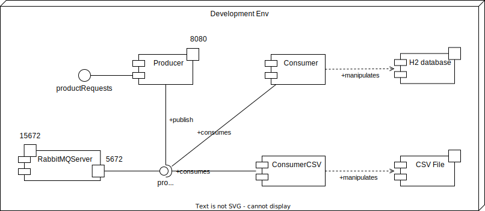

# Packages Diagrams

## Producer Package Diagram

    

## ConsumerDb Package Diagram

    

## ConsumerCsv Package Diagram

    

## Componets Diagram 

This System consists of the following components.

    

The overall structural approach employed is Microservices, while additionally, the event-driven architectural design was implemented to manage the Publisher/Subscriber model.

## Producer sequence Diagram

this component works as a CRUD server for OpenMarket. It also publishes 
events in a RabbitMQ Fanout.

    

## ConsumerDb sequence Diagram

This component receives the message from RabbitMQ that contains the product object 
with the realized action and stores it in the database.

    

## ConsumerCsv sequence Diagram

 This component receives the message from RabbitMQ that contains a petition, which will then be stored in a CSV file.

    

