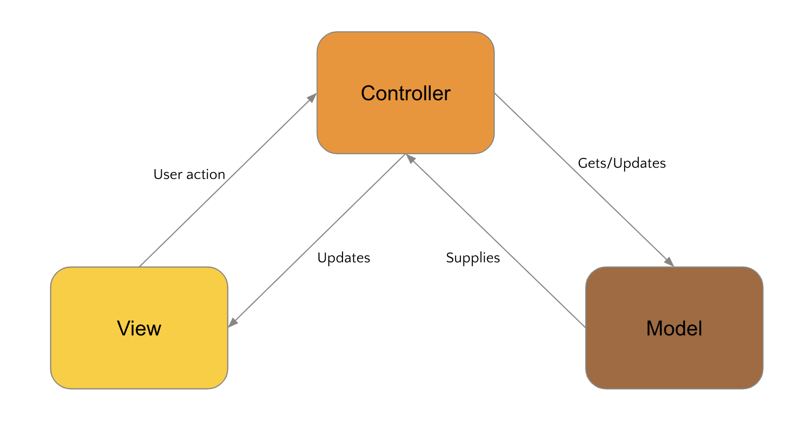

# Architectural Patterns: MVC (Model View Controller)

MVC is a software architectural pattern that separates an application into three interconnected components: the model, the view, and the controller. The model represents the data and business logic, the view displays the data to the user, and the controller handles user input and updates the model and view.

The MVC pattern helps to separate the concerns of an application, making it easier to maintain and modify the code. By separating the user interface from the business logic, it also makes it easier to test and reuse the code.



## History

The Model-View-Controller (MVC) pattern was first introduced in the 1970s by Trygve Reenskaug, a Norwegian computer scientist. It was originally developed as part of the Smalltalk-76 programming language, and was designed as a way to separate the user interface from the application logic.

Over the years, the MVC pattern has become a popular architectural pattern in software development. It is widely used in web development, desktop application development, and mobile app development, among other areas.

## Currently

Many real companies use the MVC pattern in their software development. For example, the popular web framework Ruby on Rails which is based on the MVC pattern. In this case, the Model component represents the data model, the View component represents the templates used to generate the HTML that is sent to the client, and the Controller component represents the application logic that processes incoming requests and generates responses.

Other MVC frameworks and tools: Laravel, Angular, ASP.NET MVC, Spring MVC

## Model

The Model component is responsible for managing the application's data and business logic. It encapsulates the data and provides methods to manipulate and access that data. The Model component does not have any knowledge of the user interface or presentation layer, and its methods are not concerned with how the data is presented or displayed.

```java
public class UserModel {
    private String name;
    private String email;
    private int age;

    public UserModel(String name, String email, int age) {
        this.name = name;
        this.email = email;
        this.age = age;
    }

    // Getter and setter methods for the UserModel's fields
    ...

    // Other methods for manipulating the UserModel's data and business logic
    public boolean isAdult() {
        return age >= 18;
    }

    public boolean isNameValid() {
        // Some validation logic for the user's name
    }
}
```

## View

The View component is responsible for presenting the data to the user. It receives data from the Model and displays it in a user-friendly format. The View component does not have any knowledge of the data or the business logic behind it, and it does not modify the data in any way.

```java
public class UserView {
    public void displayUserData(UserModel user) {
        System.out.println("Name: " + user.getName());
        System.out.println("Email: " + user.getEmail());
        System.out.println("Age: " + user.getAge());
    }
}
```

## Controller

The Controller component acts as an intermediary between the Model and the View. It receives input from the user via the View, processes that input, and updates the Model and View as necessary. The Controller component contains the application logic and is responsible for updating the Model when the user interacts with the View, and for updating the View when the Model changes.

```java
public class UserController {
    private UserModel model;
    private UserView view;

    public UserController(UserModel model, UserView view) {
        this.model = model;
        this.view = view;
    }

    public void setUserAge(int age) {
        model.setAge(age);
    }

    public void updateView() {
        view.displayUserData(model);
    }
}
```

## [Code example](../rails/mvc_example/README.md)
