# Iterator

## Description: 
The Iterator Pattern is a design pattern that provides a way to access the elements of a collection without exposing its underlying representation or modifying its structure. This pattern allows you to traverse a collection of elements in a consistent manner regardless of its specific implementation.
jsjsjs

## Problem: 

Collections are a fundamental data type in programming languages, and we often need to access information stored in them. Typically, collections provide methods for accessing their contents in a straightforward way. However, there may be situations where we need to access a collection in a different way than the one provided by its default methods.

For instance, we may need to traverse a collection in a specific order or filter its elements based on certain criteria. In such cases, relying solely on the default collection methods may not be sufficient

## Solution

the Iterator Pattern provied us a way to access the elements of a collection in a consistent and flexible manner, without modifying the underlying collection structure.

By decoupling the traversal of a collection from its storage and organization, the Iterator Pattern allows us to access the collection's elements efficiently, while also enabling us to change the way we access them without affecting the rest of the codebase. This makes it a valuable tool for building scalable and maintainable software systems.

### Example

Let's consider the example of a large company like Amazon that maintains a collection of its products. Suppose the company wants to display its products in the order in which they were added to the collection. However, they also want to avoid displaying the products in reverse order, starting from the most recently added ones.

### Structure

The following diagram describes the pattern using the example as analogy

<p align="center">
    
</p>

### Implementation

To begin, we should create the interfaceIteratorClass, which must contain two essential methods. The first method enables us to determine if we have traversed the entire collection, while the second method enables us to retrieve the next element in the collection.

These two methods are named hasNext() and getNext(), respectively. The hasNext() method allows us to check if there are more elements left to iterate through in the collection, while the getNext() method retrieves the next element in the sequence.

```
public interface ProductsIterator {
    public Product getNext();
    public boolean hasNext();
}

```

In order to provide the required functionality, we implement the interface in all the necessary classes. For instance, in the case of Amazon, they need to access the collection in both a rotated and reversed way. Therefore, we create a corresponding class for each way of traversing the array.

```
public class ProductRotateIterator implements ProductsIterator{
    
    private int currentPosition = 0;
    private List<Product> productos = new ArrayList<>();

    public ProductRotateIterator(List<Product> productos) {
        this.productos = productos;
    }
    
    
    
    @Override
    public Product getNext(){
        if(!hasNext()){
            return null;
        }
        Product productAux = productos.get(currentPosition);
        currentPosition++;
        return productAux;
    }
    
    @Override
    public boolean hasNext(){
        return currentPosition < productos.size();
    }
}

public class ProductReveseIterator implements ProductsIterator{
    
     private int currentPosition;
    private List<Product> productos = new ArrayList<>();

    public ProductReveseIterator (List<Product> productos) {
        this.productos = productos;
        this.currentPosition = productos.size()-1;
    }
    
    
    
    @Override
    public Product getNext(){
        if(!hasNext()){
            return null;
        }
        Product productAux = productos.get(currentPosition);
        currentPosition--;
        return productAux;
    }
    
    @Override
    public boolean hasNext(){
        return currentPosition >= 0;
    }
    
}
```

We have created an AmazonProduct Interface that serves as our guide for how Amazon will handle the collection.

```
public interface AmazonProducts {
    public void addProduct(Product product);
    public ProductRotateIterator iterator();
    public ProductReveseIterator revIterator();
    
}

```

We have finally implemented the Amazon class, which implements the AmazonProduct Interface.

```
public class Amazon implements AmazonProducts{
      private List<Product> productos = new ArrayList<>();

    public Amazon() { 
        
    }
    
    public Amazon(List<Product> productos) {
        this.productos = productos;
    }
    
    @Override
    public void addProduct(Product product){
        productos.add(product);
    }
    
    @Override
    public ProductRotateIterator iterator(){
        return new ProductRotateIterator(productos);
    }
    
    @Override
    public ProductReveseIterator revIterator(){
        return new ProductReveseIterator(productos);
    }
    
}

```
We have successfully implemented the Iterator Design Pattern in this case, as each class relies on the same interface to iterate through objects. This allows us to traverse the array in any way we desire, demonstrating the flexibility of the design pattern.


