# Template Method

## Description

The Template Method pattern is a behavioral design pattern that defines the skeleton of an algorithm in a superclass, while allowing subclasses to override specific steps of the algorithm without changing its structure. This pattern promotes code reuse by providing a common structure for related algorithms while allowing their implementations to vary.

## Problem

In software development, we often encounter situations where multiple algorithms perform similar tasks, but with slight variations in their implementation. For instance, suppose we have several payment processing algorithms that use different payment gateways and authentication methods. In this case, we might end up duplicating code and violating the DRY (Don't Repeat Yourself) principle, which can lead to maintenance issues and bugs.

## Solution

The Template Method pattern provides a solution by defining a common algorithm structure in a superclass, while allowing subclasses to implement specific steps of the algorithm. The superclass acts as a template that provides a framework for the algorithm, while the subclasses provide the implementation details.

The template method consists of several steps that are executed in a specific order. The superclass defines the overall structure of the algorithm, including the steps that cannot be changed by the subclasses. However, it also provides hooks, which are methods that can be overridden by the subclasses to customize specific steps of the algorithm.

### Example

Let's consider a scenario where we aim to design a pizza-making system that helps control the pizza production process.

### Structure

The following diagram describes the pattern using the example as analogy

<p align="center">
    
</p>

### Implementation

First we Create The abstractClass in this case is the AbstractPizzaOrder.

```
public abstract class AbstractPizzaOrder {
    
     public void makePizzaDough(){
         System.out.println("The pizza mass was created");
         
     }; // prints a string
    
    public  abstract void addTopping1(); // adds a topping
    
    public abstract void  addTopping2(); // adds a topping
    
    public  abstract void addSauce(); // adds a sauce
    
    public  abstract void addCheese(); // adds a cheese
    
    public  void boxPizza() { // default implementation of boxPizza method
        System.out.println("boxed pizza Succesfully"); // prints a message
    }
    
}

``` 

Then we created three classes that implemented the abstrac class but each class is going to have a different behaviur.

```
public class BasicPizza extends AbstractPizzaOrder{
    
    public  void addTopping1(){
    }; // adds a topping
    
    public  void  addTopping2(){
    };
    
     public void addSauce(){
         System.out.print("Add Home Sauce Succesfully");
     }; // adds a sauce
    
    public void addCheese(){
        System.out.print("Add Chedar Chesee Succesfully");
    };
     
}

public class EspecialPizza extends AbstractPizzaOrder{
    
    public  void addTopping1(){
        System.out.print("Add Chicken Topping Succesfully");
    }; // adds a topping
    
    public  void  addTopping2(){
        System.out.print("Add Beacon Topping Succesfully");
    };
    
     public void addSauce(){
         System.out.print("Add Home Sauce Succesfully");
     }; // adds a sauce
    
    public void addCheese(){
        System.out.print("Add Chedar Chesee Succesfully");
    };
    
}

public class PeperonniPizza extends AbstractPizzaOrder{
    
    public  void addTopping1(){
         System.out.print("Peperonni Topping Succesfully");
        
    }; // adds a topping
    
    public  void  addTopping2(){
        
    };
    
     public void addSauce(){
         System.out.print("Add BBQ Sauce Succesfully");
     }; // adds a sauce
    
    public void addCheese(){
        System.out.print("Add Chedar Chesee Succesfully");
    };

    
}

```

We can observe that each pizza adheres to the structure defined by the abstract class, while also exhibiting its own unique behavior based on the specific requirements of the customer.


