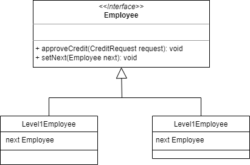

# Chain of Responsibility

The Chain of Responsibility design pattern is a behavior pattern that allows a set of objects in a chain to receive and respond to a request based on their ability to do so.

The main idea behind this pattern is to decouple the sender of a request from its possible receivers and allow a set of objects to handle the request. The objects in the chain are connected in a sequence, and each object in the chain has a reference to the next object.

When a request hits the chain, the first object in the chain tries to handle it. If the object can handle the request, it does so and the process terminates. If it cannot handle the request, it is passed to the next object in the chain, and so on until an object that can handle the request is found, or until the request reaches the end of the chain.

Problem: Imagine that you have a system that processes different types of credit applications. Each request must be verified by different levels of authorization before being approved. For example, credit applications less than $10,000 must be approved by a level 1 employee, while credit applications greater than $10,000 must be approved by a level 2 employee. You need a solution that allows you to process these applications efficient and scalable.

Solution: To solve this problem, we can use the Chain of Responsibility behavior pattern in Java. This pattern allows you to build a chain of receiver objects that process a request until one of them can handle it. In our case, we can create a string of Employee objects that represent employees of different authorization levels. Each Employee object has a reference to the next employee in the chain and a method that checks if it can handle a request. If the Employee object can handle the request, she does; otherwise, it sends it to the next employee in the chain.

Here is the sample code:
~~~java
// Class representing a credit application
public class CreditRequest {
     private double amount;

     public CreditRequest(double amount) {
         this.amount = amount;
     }

     public double getAmount() {
         return amount;
     }
}

// Interface that defines the behavior of the Employee objects
public interface Employee {
     void approveCredit(CreditRequest request);
     void setNext(Employee next);
}

// Class representing a level 1 employee
public class Level1Employee implements Employee {
     private Employee next;

     @Override
     public void approveCredit(CreditRequest request) {
         if (request.getAmount() <= 10000) {
             System.out.println("Request approved by a level 1 employee.");
         } else if (next != null) {
             next.approveCredit(request);
         } else {
             System.out.println("The request cannot be approved.");
         }
     }

     @Override
     public void setNext(Employee next) {
         this. next = next;
     }
}

// Class representing a level 2 employee
public class Level2Employee implements Employee {
     private Employee next;

     @Override
     public void approveCredit(CreditRequest request) {
         if (request.getAmount() > 10000) {
             System.out.println("Request approved by a level 2 employee.");
         } else if (next != null) {
             next.approveCredit(request);
         } else {
             System.out.println("The request cannot be approved.");
         }
     }

     @Override
     public void setNext(Employee next) {
         this. next = next;
     }
}

// Example of using the Chain of Responsibility pattern
public class CreditRequestHandler {
     public static void main(String[] args) {
         Employee employee1 = new Level1Employee();
         Employee employee2 = new Level2Employee();
         employee1. setNext(employee2);

         CreditRequest request1 = new CreditRequest(5000);
         CreditRequest request2 = new CreditRequest(15000);

         employee1.approveCredit(request1); // Prints "Request approved by a level 1 employee."
         employee1.approveCredit(request2); // Print "
~~~

# Diagrama Chain of Responsibility 

