# Chain of Responsibility

## Description:

Chain of responsibility is a behavioral design pattern that consists of passing requests along a chain of handlers, each handler decides either to process the request or to pass it to the next handler in the chain. The Chain of Responsibility is based on transforming particular behaviors into autonomous objects called handlers.

## Problem:

There is an request that may require several procedures, but if one of these procedures fails or a single procedure is capable of processing the request, it is not necessary to perform the other procedures as this would be inefficient.

## Solution:

The solution is to create a Chain of Responsibility, in which each link will be a procedure in charge of processing the request, if the first procedure is capable of processing the request, this procedure will end the Chain of Responsibility, but if this procedure is not capable of processing the request, it will be passed to the next link in the chain.

## Example:

Imagine that you are developing a program that is responsible for offering online assistance for an appliance, if a customer requests assistance because their appliance does not work, it would be inefficient to direct the customer directly to a technician if their problem turns out to be that they simply have not connected the appliance to electric current.

The solution to this problem is to use the Chain of Responsibility design pattern, in which a handler will be in charge of providing the client with basic help, such as a Chat Bot, this handler will decide if it passes the help request to the next link in the chain, or he is able to process the request.

### Structure:

<p align="center">
    
</p>

### Implementation:

The Chain of Responsibility design pattern has the following structure:

1 - The Handler declares the interface, common for all concrete handlers. It usually contains just a single method for handling requests, but sometimes it may also have another method for setting the next handler on the chain.

```Java

interface IHandler{
    public void request(int problemDegree);

    public IHandler getSuccessor();

    public void setSuccessor(IHandler successor);
}

```

2 - Concrete Handlers contain the actual code for processing requests. Upon receiving a request, each handler must decide whether to process it and, additionally, whether to pass it along the chain.

Handlers are usually self-contained and immutable, accepting all necessary data just once via the constructor.

This is the first handler for this example:

```Java

class ChatBot implements IHandler{

    private IHandler successor;

    //This method is the one that decides if this handler is capable of attending to the request, or if it exceeds its capabilities and must go to the next link in the chain.
    @Override
    public void request(int problemDegree){
        if(problemDegree <= 1){
            JOptionPane.showMessageDialog(null, "The problem has been taken care of by the Chat Bot!");
        } else {
            successor.request(problemDegree);
        }
    }

    @Override
    public IHandler getSuccessor(){
        return successor;
    }

    @Override
    public void setSuccessor(IHandler successor){
        this.successor = successor;
    }  
}

```

This is the seccond handler for this example:

```Java

class ChatHuman implements IHandler{

    private IHandler successor;

    //This method is the one that decides if this handler is capable of attending to the request, or if it exceeds its capabilities and must go to the next link in the chain.
    @Override
    public void request(int problemDegree){
        if(problemDegree > 1 && problemDegree < 3){
            JOptionPane.showMessageDialog(null, "Human Chat has taken care of the problem!");
        } else {
            successor.request(problemDegree);
        }
    }

    @Override
    public IHandler getSuccessor(){
        return successor;
    }

    @Override
    public void setSuccessor(IHandler successor){
        this.successor = successor;
    }  
}

```

This is the third handler for this example:

```Java

class TechnicalPhoneCall implements IHandler{

    private IHandler successor;

    //This method is the one that decides if this handler is capable of attending to the request, or if it exceeds its capabilities and must go to the next link in the chain.
    @Override
    public void request(int problemDegree){
        if(problemDegree >= 3){
            JOptionPane.showMessageDialog(null, "TechnicalPhoneCall has taken care of the problem!!");
        } else {
            successor.recuest(problemDegree);
        }
    }

    @Override
    public IHandler getSuccessor(){
        return successor;
    }

    @Override
    public void setSuccessor(IHandler successor){
        this.successor = successor;
    }  
}

```
3 - The Client may compose chains just once or compose them dynamically, depending on the application’s logic. Note that a request can be sent to any handler in the chain—it doesn’t have to be the first one.

```Java

class HelpCenter implements IHandler{

    private IHandler successor;

    @Override
    public void request(int monto){
        ChatBot chatBot = new ChatBot();
        setSuccessor(chatBot);

        ChatHuman chatHuman = new ChatHuman();
        chatBot.setSuccessor(chatHuman);

        TechnicalPhoneCall technicalPhoneCall = new TechnicalPhoneCall();
        chatHuman.setSuccessor(technicalPhoneCall);
    }

    @Override
    public IHandler getSuccessor(){
        return successor;
    }

    @Override
    public void setSuccessor(IHandler successor){
        this.successor = successor;
    }  
}

```

This is the Main class:

```Java
public class Main {
    public static void main(String[] args) {
        int problemDegree = Integer.parseInt(JOptionPane.showImputDialog(null "Enter the degree of your problem: "));
        HelpCenter helpCenter = new HelpCenter();
        helpCenter.request(problemDegree);
    }
}
```