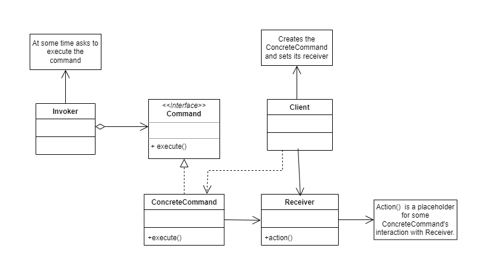

# Command

The "Command" design pattern is a behavioral design pattern that is used to encapsulate a request as an object, allowing clients to parameterize requests with different commands, queue or register requests, and support undoable operations.

The "Command" pattern typically consists of the following elements:

* Command: It is an interface or abstract class that defines the contract for executing a request. It may have a method such as "execute()" that performs the action associated with the command.

* Invoker: It is the object that requests the execution of a command. It may hold a reference to a command object and can invoke the "execute()" method on the command object to perform the request.

* Receiver: It is the object that performs the actual action associated with the command. The command may hold a reference to a receiver and can invoke the methods of the receiver to carry out the requested action.

* Client: It is the object that configures the commands and associates them with invokers. It can create command objects, assign them receivers, and configure invokers to use the appropriate commands.

* Command Client: It is the object that interacts directly with the commands and provides the specific business logic to execute the commands in the appropriate order and sequence.

# Class Diagram



# Problem

```Java
// Class to represent a remote control
class RemoteControl {
    public void turnOnTV() {
        System.out.println("Turning on the TV...");
        // Logic to turn on the TV
    }

    public void turnOffTV() {
        System.out.println("Turning off the TV...");
        // Logic to turn off the TV
    }

    public void increaseVolume() {
        System.out.println("Increasing the TV volume...");
        // Logic to increase the TV volume
    }

    public void decreaseVolume() {
        System.out.println("Decreasing the TV volume...");
        // Logic to decrease the TV volume
    }
}

// Client class that uses the remote control
public class Client {
    public static void main(String[] args) {
        // Create an instance of the remote control
        RemoteControl remoteControl = new RemoteControl();

        // Perform actions on the remote control
        remoteControl.turnOnTV();
        remoteControl.increaseVolume();
        remoteControl.decreaseVolume();
        remoteControl.turnOffTV();
    }
}
```

In this example, the client interacts directly with the remote control and calls the corresponding methods to perform actions such as turning on the TV, increasing or decreasing the volume, and turning off the TV. However, the "Command" design pattern is not used to encapsulate these actions as objects, which could result in problems such as code duplication if similar actions need to be performed in different parts of the system, difficulty in extending or adding new actions, lack of flexibility in managing requests and actions at runtime, and difficulty in implementing reversible operations, among others. The "Command" pattern would provide a more structured and flexible solution for handling the actions of the remote control.

# Solution

```Java
// Command interface
interface Command {
    void execute();
}

// Concrete command classes
class TurnOnTVCommand implements Command {
    private RemoteControl remoteControl;

    public TurnOnTVCommand(RemoteControl remoteControl) {
        this.remoteControl = remoteControl;
    }

    @Override
    public void execute() {
        remoteControl.turnOnTV();
    }
}

class TurnOffTVCommand implements Command {
    private RemoteControl remoteControl;

    public TurnOffTVCommand(RemoteControl remoteControl) {
        this.remoteControl = remoteControl;
    }

    @Override
    public void execute() {
        remoteControl.turnOffTV();
    }
}

class IncreaseVolumeCommand implements Command {
    private RemoteControl remoteControl;

    public IncreaseVolumeCommand(RemoteControl remoteControl) {
        this.remoteControl = remoteControl;
    }

    @Override
    public void execute() {
        remoteControl.increaseVolume();
    }
}

class DecreaseVolumeCommand implements Command {
    private RemoteControl remoteControl;

    public DecreaseVolumeCommand(RemoteControl remoteControl) {
        this.remoteControl = remoteControl;
    }

    @Override
    public void execute() {
        remoteControl.decreaseVolume();
    }
}

// Invoker class
class RemoteControlInvoker {
    private Command command;

    public void setCommand(Command command) {
        this.command = command;
    }

    public void executeCommand() {
        command.execute();
    }
}

// Receiver class
class RemoteControl {
    public void turnOnTV() {
        System.out.println("Turning on the TV...");
        // Logic to turn on the TV
    }

    public void turnOffTV() {
        System.out.println("Turning off the TV...");
        // Logic to turn off the TV
    }

    public void increaseVolume() {
        System.out.println("Increasing the TV volume...");
        // Logic to increase the TV volume
    }

    public void decreaseVolume() {
        System.out.println("Decreasing the TV volume...");
        // Logic to decrease the TV volume
    }
}

// Client class
public class Client {
    public static void main(String[] args) {
        // Create an instance of the remote control
        RemoteControl remoteControl = new RemoteControl();

        // Create instances of the command objects and associate them with the remote control
        TurnOnTVCommand turnOnTVCommand = new TurnOnTVCommand(remoteControl);
        TurnOffTVCommand turnOffTVCommand = new TurnOffTVCommand(remoteControl);
        IncreaseVolumeCommand increaseVolumeCommand = new IncreaseVolumeCommand(remoteControl);
        DecreaseVolumeCommand decreaseVolumeCommand = new DecreaseVolumeCommand(remoteControl);

        // Create an instance of the invoker
        RemoteControlInvoker invoker = new RemoteControlInvoker();

        // Set commands on the invoker
        invoker.setCommand(turnOnTVCommand);
        invoker.executeCommand();

        invoker.setCommand(increaseVolumeCommand);
        invoker.executeCommand();

        invoker.setCommand(decreaseVolumeCommand);
        invoker.executeCommand();

        invoker.setCommand(turnOffTVCommand);
        invoker.executeCommand();
    }
}

```

In this example, the "Command" design pattern is used to encapsulate different actions that can be performed on a TV remote control, such as turning on the TV, turning off the TV, increasing the volume, and decreasing the volume, into concrete command classes. The invoker (RemoteControlInvoker) is responsible for executing the commands at runtime, and the receiver (RemoteControl) is the class that actually performs the logic of the actions. This allows for greater flexibility and extensibility in manipulating actions, as commands can be changed at runtime without affecting the logic of the receiver.
