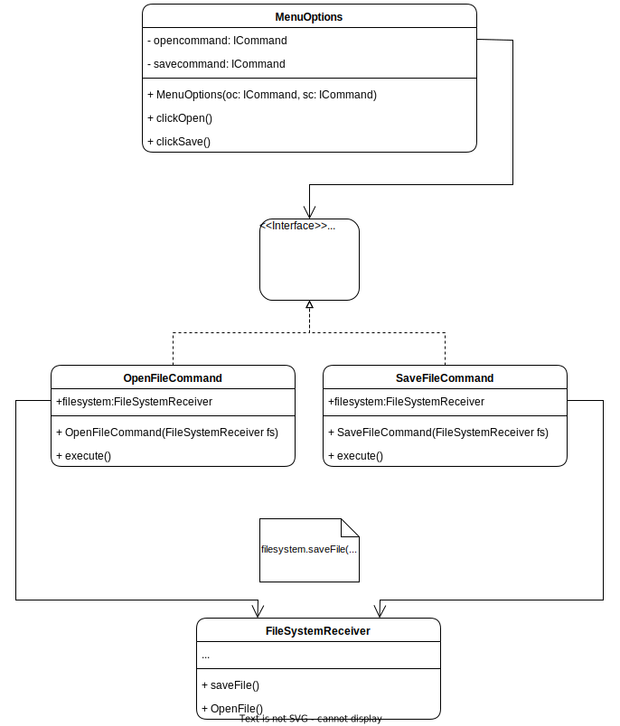

# Command 
## Description
The Command Design Pattern is a behavioral design pattern that provides a way to decouple an object that invokes an operation from the object that knows how to perform it. This pattern encapsulates a request for an operation in a command object, which allows the invoker object to store the command object and call its execute method when the operation is required.
## Problem:
 Sometimes it's necessary to implement functionality that allows for the separation of the object invoking an operation from the object actually performing it. In this case, it's not possible to directly invoke the required operation on the receiver object, as the invoker object has no knowledge of the receiver object's implementation details.
## Solution:
The Command Design Pattern provides a way to decouple the invoker object from the receiver object by encapsulating the request for an operation in a command object. This command object is responsible for invoking the required operation on the receiver object. The invoker object simply has to store the command object and call its execute method when the operation is required. This allows for the receiver object to be easily swapped out or modified without impacting the invoker object.
## Example: 

Imagine that you are building a text editor application that allows users to edit and format text. The editor needs to support different types of commands such as opening a file, saving a file, formatting text, etc. You want to implement these commands in a way that allows you to add new commands easily without changing the existing code.

### Structure
<p align="center">
    
</p>


### Implementation


1. Declare the command interface with a single execution method:
``` Java
public interface ICommand {
    void execute();
}

```
2. Start extracting requests into concrete command classes that implement the command interface:

``` Java
public class OpenFileCommand implements ICommand {
    private final FileSystemReceiver fileSystem;

    public OpenFileCommand(FileSystemReceiver fs) {
        this.fileSystem = fs;
    }

    @Override
    public void execute() {
        fileSystem.openFile();
    }
}

public class SaveFileCommand implements ICommand {
    private final FileSystemReceiver fileSystem;

    public SaveFileCommand(FileSystemReceiver fs) {
        this.fileSystem = fs;
    }

    @Override
    public void execute() {
        fileSystem.saveFile();
    }
}

```
3. Identify classes that will act as senders:

``` Java
public class MenuOptions {
    private final ICommand openCommand;
    private final ICommand saveCommand;

    public MenuOptions(ICommand open, ICommand save) {
        this.openCommand = open;
        this.saveCommand = save;
    }

    public void clickOpen() {
        openCommand.execute();
    }

    public void clickSave() {
        saveCommand.execute();
    }
}

```
4. Change the senders so they execute the command instead of sending a request to the receiver directly:

``` Java
FileSystemReceiver fileSystem = new FileSystemReceiver();
ICommand openCommand = new OpenFileCommand(fileSystem);
ICommand saveCommand = new SaveFileCommand(fileSystem);

MenuOptions menu = new MenuOptions(openCommand, saveCommand);
menu.clickOpen();
menu.clickSave();

```
5. Initialize objects in the following order:
``` Java
//1. Create receivers.
FileSystemReceiver fileSystem = new FileSystemReceiver();

//2. Create commands, and associate them with receivers if needed.
ICommand openCommand = new OpenFileCommand(fileSystem);
ICommand saveCommand = new SaveFileCommand(fileSystem);

//3. Create senders, and associate them with specific commands.
MenuOptions menu = new MenuOptions(openCommand, saveCommand);

```
In this example, the Command pattern allows you to encapsulate each command as an object, making it easy to add new commands without changing the existing code. The sender classes (MenuOptions) only need to know about the command interface, and they can invoke commands without knowing anything about their implementations.


