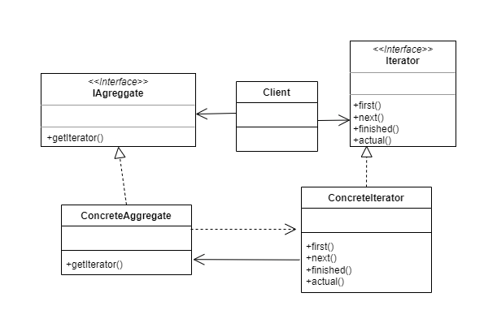

# Iterator

The "Iterator" design pattern is a behavioral design pattern that is used to provide a way to sequentially access the elements of a collection without exposing its internal structure. The Iterator pattern allows for efficient traversal of a collection of objects without needing to know the implementation details of the collection.

The Iterator pattern consists of two main components:

* Iterator: It is an interface that defines the methods for traversing a collection of objects. Typically, it includes methods such as next() to get the next element, hasNext() to check if there are more elements, and remove() to remove an element from the collection while iterating.

* Collection: It is the data structure that contains the elements to be traversed. It can be a list, an array, a tree, a matrix, or any other data structure. The collection should provide a method to obtain an iterator that implements the Iterator interface.

# Class Diagram



# Problem

```Java
public class PeopleList {
    private Person[] people;
    private int index;

    public PeopleList() {
        people = new Person[10];
        index = 0;
    }

    public void addPerson(Person person) {
        people[index] = person;
        index++;
    }

    public Person[] getPeople() {
        return people;
    }

    // There is no method to obtain an iterator
}
```

In this example, a PeopleList class is created to represent a collection of Person objects. However, the class does not provide an iterator to efficiently traverse the objects in the list. Instead, it directly exposes an array of people through the getPeople() method, which exposes the internal structure of the collection. This can be inconvenient if you want to sequentially iterate through the list of people without exposing the internal implementation of the array.

In this case, if you want to iterate through the list of people, you would have to directly access the array of people and use a loop to iterate over the elements. This can be inconvenient and error-prone, especially if the internal implementation of the people list changes in the future, such as switching from an array to a linked list.

Using the Iterator pattern would allow encapsulating the internal structure of the collection and providing a more efficient and safe way to iterate through the elements of the people list without exposing the internal implementation.

# Solution

```Java
public class PeopleList {
    private Person[] people;
    private int index;

    public PeopleList() {
        people = new Person[10];
        index = 0;
    }

    public void addPerson(Person person) {
        people[index] = person;
        index++;
    }

    public Person[] getPeople() {
        return people;
    }

    // Method to obtain an iterator
    public PeopleIterator getIterator() {
        return new PeopleIterator();
    }

    // Inner class that implements the iterator
    private class PeopleIterator {
        private int currentIndex;

        public PeopleIterator() {
            currentIndex = 0;
        }

        public boolean hasNext() {
            return currentIndex < index;
        }

        public Person next() {
            if (hasNext()) {
                Person person = people[currentIndex];
                currentIndex++;
                return person;
            } else {
                throw new NoSuchElementException();
            }
        }

        public void remove() {
            throw new UnsupportedOperationException();
        }
    }
}
```

In this example, the PeopleList class provides a getIterator() method that returns an object of the inner class PeopleIterator, which implements the iterator. The PeopleIterator class has hasNext(), next(), and remove() methods to efficiently iterate through the collection of persons in PeopleList, following the Iterator design pattern.

With this implementation, you can use the getIterator() method to obtain an iterator and then use the hasNext() and next() methods of the iterator in a while loop to iterate through the Person objects in the PeopleList, without exposing the internal structure of the people collection.


