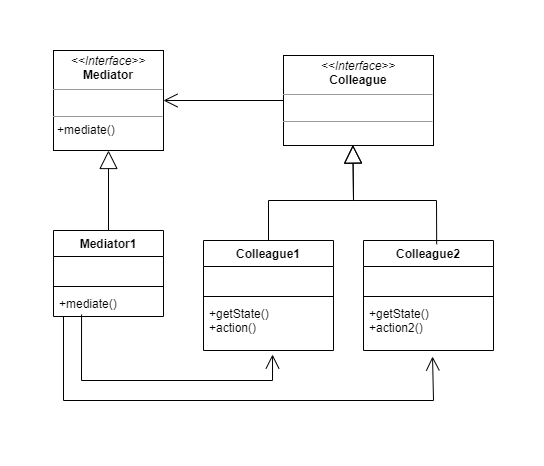

# Mediator

The Mediator design pattern is used to reduce the complexity and dependencies between components of a system, promoting indirect communication among them through a central mediator object.

The goal of the Mediator pattern is to minimize the coupling between the components of a system, promoting independence and code reusability. Instead of components communicating directly with each other, they do so through a mediator object that coordinates interactions between them. This helps maintain a high level of modularity and facilitates system extensibility and maintainability.

The Mediator pattern generally consists of the following elements:

* Mediator: It is an interface or abstract class that defines the methods for communication between the components of the system. Components communicate with each other through the mediator instead of doing so directly.

* Components (Colleagues): These are the different elements of the system that need to communicate with each other, but do so through the mediator instead of communicating directly. Each component has a reference to the mediator and communicates with it through the interface or methods defined by the mediator.

The Mediator pattern can provide several benefits, such as:

* Reduction of coupling: Having a central mediator object that coordinates interactions between components reduces direct coupling between the components of the system. This allows for changes and updates to individual components without affecting other components.

* Centralized control: The mediator centralizes control of communication and interaction logic between components. This facilitates understanding and maintenance of communication flow in the system.

* Promotion of reusability: By having a mediator that coordinates communication between components, the same mediator can be reused in different contexts or scenarios, facilitating code reuse.

# Class Diagram



# Problem

Imagine you have an instant messaging system where multiple users can send messages to each other. Without using the Mediator pattern, you could have a code similar to this:

```Java
class User {
    private String name;
    
    public User(String name) {
        this.name = name;
    }
    
    public void sendMessage(String message, User recipient) {
        System.out.println(this.name + " sends message: " + message + " to " + recipient.name);
        recipient.receiveMessage(message, this);
    }
    
    public void receiveMessage(String message, User sender) {
        System.out.println(this.name + " receives message: " + message + " from " + sender.name);
    }
}

public class InstantMessagingSystem {
    public static void main(String[] args) {
        User user1 = new User("User1");
        User user2 = new User("User2");
        
        user1.sendMessage("Hello!", user2);
        user2.sendMessage("Hi! How are you?", user1);
    }
}
```

In this example, users communicate directly with each other to send and receive messages in an instant messaging system. This can result in direct coupling between users, which can complicate the extensibility and maintainability of the system as it grows in size and complexity. If more functionality or changes in the communication logic are required, it may be necessary to modify multiple classes.

By applying the Mediator pattern, users would communicate through a central mediator object, reducing direct coupling between them and facilitating the extensibility and maintainability of the system. The mediator would be responsible for coordinating interactions between users, centralizing control of communication, and allowing for reuse of the same mediator in different contexts or scenarios.

# Solution

```Java
interface Mediator {
    void sendMessage(String message, User user);
    void addUser(User user);
}

class ChatMediator implements Mediator {
    private List<User> users = new ArrayList<>();

    @Override
    public void sendMessage(String message, User user) {
        for (User u : users) {
            if (u != user) {
                u.receiveMessage(message);
            }
        }
    }

    @Override
    public void addUser(User user) {
        users.add(user);
    }
}

class User {
    private String name;
    private Mediator mediator;

    public User(String name, Mediator mediator) {
        this.name = name;
        this.mediator = mediator;
    }

    public void sendMessage(String message) {
        mediator.sendMessage(message, this);
    }

    public void receiveMessage(String message) {
        System.out.println(name + " receives message: " + message);
    }
}

public class InstantMessagingSystem {
    public static void main(String[] args) {
        ChatMediator chatMediator = new ChatMediator();
        User user1 = new User("User1", chatMediator);
        User user2 = new User("User2", chatMediator);
        
        chatMediator.addUser(user1);
        chatMediator.addUser(user2);
        
        user1.sendMessage("Hello!");
        user2.sendMessage("Hi! How are you?");
    }
}

```

In this example, the Mediator pattern is used to implement an instant messaging system. The mediator (ChatMediator) acts as an intermediary between users (User), and users communicate with the mediator instead of communicating directly with each other. The mediator is responsible for coordinating interactions among users, and users register with the mediator by adding themselves to the list of users. When a user sends a message, they do so through the mediator, which forwards the message to the intended recipients, excluding the sender. This reduces direct dependencies among users and facilitates system extensibility and maintainability, as any changes in the communication logic only need to be made in the mediator.