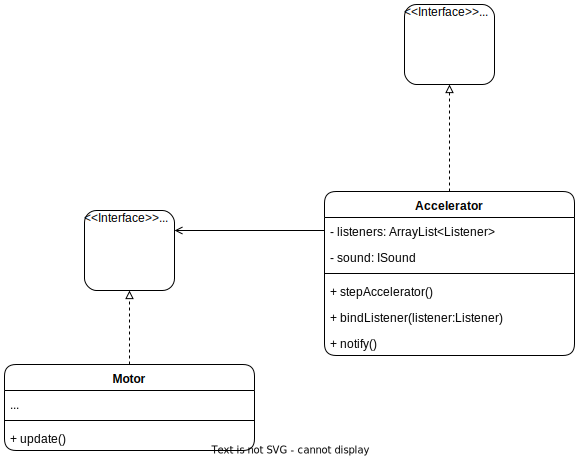

# Observer

## Description:

Observer is a behavioral design pattern that lets you define a subscription mechanism to notify multiple objects about any events that happen to the object they’re observing.

## Problem:

Imagine that you have two objects, an object "a" and an object "b", and the object "b" wants to know if there is an eventuality in the object "a", so the object "b" is continuously checking the object "a" until the eventuality occurs, which causes object "b" to check object "a" many times to no avail.

On the other hand if object "a" constantly notifies object "b" about its status, this could cause spam.

## Solution:

The object that has some interesting state is often called subject, but since it’s also going to notify other objects about the changes to its state, we’ll call it publisher. All other objects that want to track changes to the publisher’s state are called subscribers.

The Observer pattern suggests that you add a subscription mechanism to the publisher class so individual objects can subscribe to or unsubscribe from a stream of events coming from that publisher. Fear not! Everything isn’t as complicated as it sounds. In reality, this mechanism consists of one an array field for storing a list of references to subscriber objects and two several public methods which allow adding subscribers to and removing them from that list.

## Example:

An example can be when the accelerator of a car is stepped on and the engine reacts to this act.

### Structure:

<p align="center">
    
</p>

### Implementation:

The Observer design pattern has the following structure:

1 - The Publisher issues events of interest to other objects. These events occur when the publisher changes its state or executes some behaviors. Publishers contain a subscription infrastructure that lets new subscribers join and current subscribers leave the list.

```Java

public interface IPublisher{
    public void notify();
}

public class Accelerator implements IPublisher{

    private ArrayList<Listener> listeners;

    public void stepAccelerator(){
        listeners = new Arraylist<Listener>();
    }

    public void bindListener(Listener listener){
        listeners.add(listener);
    }
    @Override
    public void notify(){
        for(Listener listeners:listeners){
            listener.update();
        }
    }
}

```

2 - The Subscriber interface declares the notification interface. In most cases, it consists of a single update method. The method may have several parameters that let the publisher pass some event details along with the update.

```Java

public interface ISubscriber{
    public void update();
}

public class Motor implements ISubscriber{
    @Override
    public void update(){
        System.out.println("Increased engine power!");
    }
}
```

3 - The Client creates publisher and subscriber objects separately and then registers subscribers for publisher updates. This can be done in the main class.

```Java

public class Main {
    public static void main(String[] args){
        Motor motor = new Motor();
        Accelerator accelerator = new Accelerator();

        accelerator.bindListener(motor);
    }
}

```