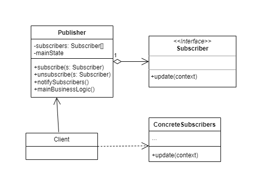

# Observer 
The Observer pattern is used to establish a one-to-many relationship between objects, so that when an object changes its state, all objects that depend on it are notified and automatically updated.

The Observer pattern consists of two main components: the subject (also known as observable or publisher) and the observers (also known as subscribers). The subject is the object being observed and has the ability to notify observers when its state changes. Observers are objects that depend on the subject and are interested in receiving notifications when the subject changes.

The Observer pattern is based on the principle of decoupling, which means that subjects and observers are separated and do not depend directly on each other. This allows for greater flexibility and extensibility in the design of the software, as observers can be added or removed without affecting the subject, and vice versa.

A common example of using the Observer pattern is in the implementation of user interface patterns, where interface elements (such as buttons or input fields) act as subjects, and interface components that need to respond to events from these elements act as observers.

Some of the benefits of the Observer pattern include:

* Decoupling: The Observer pattern allows subjects and observers to be decoupled, which means they can evolve independently without affecting each other.

* Extensibility: It is easy to add new observers without modifying the subject, allowing for greater extensibility in the design of the software.

* Flexibility: Observers can be added or removed dynamically at runtime, providing flexibility to adapt to changes in system requirements.

* Automatic updates: When the state of the subject changes, all registered observers are automatically notified, ensuring they are always updated with the current state of the subject.

* Separation of concerns: The Observer pattern allows for the separation of concerns for observation and update from the concerns of the subject, helping to maintain a more modular and organized software design.

However, there are also some considerations to keep in mind when using the Observer pattern, such as the possibility of generating unnecessary notifications if not handled properly, and the need to ensure that observers are properly registered and unregistered to avoid potential memory leaks. Overall, the Observer pattern is a powerful tool for implementing object communication in a software system and is widely used in many different contexts.

# Class Diagram


# Problem

```Java
public class Subject {
    private List<Observer> observers = new ArrayList<>();
    private int state;

    public void attach(Observer observer) {
        observers.add(observer);
    }

    public void detach(Observer observer) {
        observers.remove(observer);
    }

    public void setState(int state) {
        this.state = state;
        notifyObservers();
    }

    private void notifyObservers() {
        for (Observer observer : observers) {
            observer.update(state);
        }
    }
}

public class Observer {
    private String name;

    public Observer(String name) {
        this.name = name;
    }

    public void update(int state) {
        System.out.println("Observer " + name + " has been notified. New state: " + state);
    }
}

public class Main {
    public static void main(String[] args) {
        Subject subject = new Subject();

        Observer observer1 = new Observer("Observer 1");
        Observer observer2 = new Observer("Observer 2");

        subject.attach(observer1);
        subject.attach(observer2);

        subject.setState(1);

        subject.detach(observer1);

        subject.setState(2);
    }
}

```

In this example, the Subject class is the observable object that has a state and a list of observers. The Observer class is the object that is interested in the state of the Subject and has an update method that is called when the state of the Subject changes. The Main simply creates an instance of Subject, adds two observers, changes the state of the Subject, and then removes one observer before changing the state again.

However, this approach does not follow the Observer pattern, as there is no clear separation between the Subject and the Observer, and the communication is direct between them. This can result in tight coupling and make it difficult to extend and flexibly design the software for future changes. That's why the Observer pattern is useful in scenarios where more flexible and decoupled communication between objects is required.


# Solution

```Java
import java.util.ArrayList;
import java.util.List;

// Observer interface that defines the update method to be implemented by concrete observers
interface Observer {
    void update(int state);
}

// Subject class that maintains a list of observers and notifies them when its state changes
class Subject {
    private List<Observer> observers = new ArrayList<>();
    private int state;

    // Method to attach an observer to the subject's observer list
    public void attach(Observer observer) {
        observers.add(observer);
    }

    // Method to detach an observer from the subject's observer list
    public void detach(Observer observer) {
        observers.remove(observer);
    }

    // Method to set the state of the subject and notify all observers
    public void setState(int state) {
        this.state = state;
        notifyObservers();
    }

    // Private method to notify all observers by calling their update method
    private void notifyObservers() {
        for (Observer observer : observers) {
            observer.update(state);
        }
    }
}

// ConcreteObserver class that implements the Observer interface and defines the behavior when it's updated
class ConcreteObserver implements Observer {
    private String name;

    // Constructor to set the name of the observer
    public ConcreteObserver(String name) {
        this.name = name;
    }

    // Implementation of the update method that is called by the subject when its state changes
    @Override
    public void update(int state) {
        System.out.println("Observer " + name + " has been notified. New state: " + state);
    }
}

// Main class to demonstrate the usage of the Observer pattern
public class Main {
    public static void main(String[] args) {
        Subject subject = new Subject();

        ConcreteObserver observer1 = new ConcreteObserver("Observer 1");
        ConcreteObserver observer2 = new ConcreteObserver("Observer 2");

        subject.attach(observer1);
        subject.attach(observer2);

        subject.setState(1);

        subject.detach(observer1);

        subject.setState(2);
    }
}

```

This implementation follows the Observer pattern where the Subject maintains a list of observers and notifies them when its state changes. The Observer interface defines the update method that is implemented by the ConcreteObserver class. The Main class demonstrates how the Subject and Observer objects can be used together to achieve flexible and decoupled communication between objects.