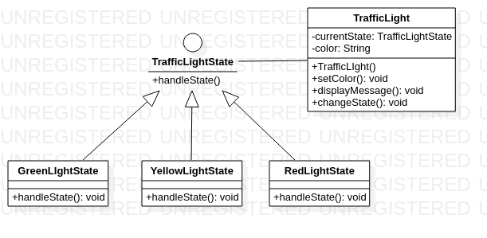

# State

The state design pattern is a behavioral pattern that allows an object to alter its behavior when its internal state changes. This pattern is useful when an object's behavior is dependent on its state and needs to change dynamically at runtime depending on that state. The state pattern involves creating separate state classes that encapsulate the behavior of the object based on its state, and the object delegates the behavior to the appropriate state object based on its current state. This results in cleaner, more modular code that is easier to maintain and extend over time.

An example of the builder pattern using Java code could be:

You're building a traffic light system that needs to change colors and display messages depending on its current state (e.g. "Green Light - Go!", "Yellow Light - Caution!", "Red Light - Stop!"). You want to implement this using the state pattern so that you can easily add or modify states in the future. First, you'll define the state interface that all traffic light states will implement:

```java
public interface TrafficLightState {
    void handleState(TrafficLight trafficLight);
}
```
Next, you'll create concrete state classes for each traffic light state:

```java
public class GreenLightState implements TrafficLightState {
    public void handleState(TrafficLight trafficLight) {
        // Change the traffic light color to green
        trafficLight.setColor("Green");
        // Display the appropriate message
        trafficLight.displayMessage("Green Light - Go!");
    }
}

public class YellowLightState implements TrafficLightState {
    public void handleState(TrafficLight trafficLight) {
        // Change the traffic light color to yellow
        trafficLight.setColor("Yellow");
        // Display the appropriate message
        trafficLight.displayMessage("Yellow Light - Caution!");
    }
}

public class RedLightState implements TrafficLightState {
    public void handleState(TrafficLight trafficLight) {
        // Change the traffic light color to red
        trafficLight.setColor("Red");
        // Display the appropriate message
        trafficLight.displayMessage("Red Light - Stop!");
    }
}
```

Finally, you'll create the context class that will hold the current state and delegate behavior to the appropriate state object:

``` java
public class TrafficLight {
    private TrafficLightState currentState;
    private String color;

    public TrafficLight() {
        // Default to the red light state
        currentState = new RedLightState();
        currentState.handleState(this);
    }

    public void setColor(String color) {
        this.color = color;
    }

    public void displayMessage(String message) {
        System.out.println(message);
    }

    public void changeState(TrafficLightState newState) {
        currentState = newState;
        currentState.handleState(this);
    }
}
```

Now you can easily change the traffic light state and behavior by calling the changeState() method on the TrafficLight object:

``` java
TrafficLight trafficLight = new TrafficLight();

// Switch to the green light state
trafficLight.changeState(new GreenLightState());

// Switch to the yellow light state
trafficLight.changeState(new YellowLightState());

// Switch back to the red light state
trafficLight.changeState(new RedLightState());
```

# Diagrama State




This will change the traffic light color and display the appropriate message based on the current state.