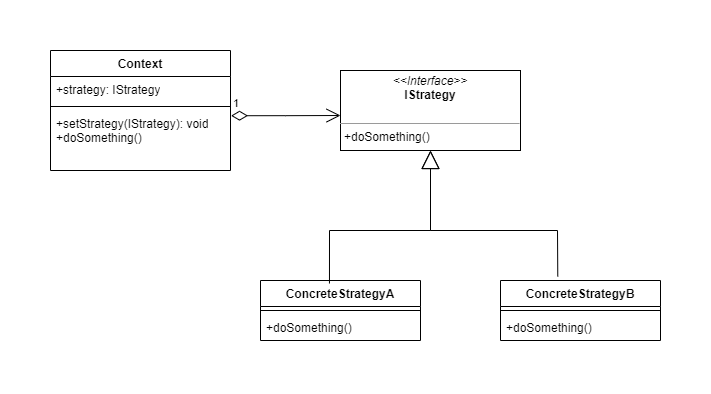

# Strategy

The "Strategy" design pattern is a behavioral design pattern in software engineering. It allows defining a family of algorithms, encapsulating them in separate classes, and making them interchangeable. This allows algorithms to vary independently of the clients that use them.

The "Strategy" pattern consists of three main elements:

* Context: This is the class that uses the algorithms. It defines a common interface to interact with the algorithms, but does not directly implement the logic of the algorithm. Instead, the execution of the algorithm is delegated to a strategy object.

* Strategy: This is an interface or abstract class that defines the contract for all the algorithms that are part of the family of algorithms. Each algorithm must implement this interface or inherit from the abstract class.

* Concrete strategy implementations: These are the concrete classes that implement the interface or inherit from the abstract class of the strategy. Each of these classes represents a specific variant of an algorithm.

# Class Diagram



# Problem
 Let's assume we are developing a payment processing system that can accept payments in different currencies such as USD, EUR, and GBP. Without using the "Strategy" design pattern, we could implement the functionality in the following way:

```Java
class PaymentProcessor {
    public void processPayment(double amount, String currency) {
        if (currency.equals("USD")) {
            // Logic for processing payments in US dollars
            System.out.println("Processing payment of " + amount + " US dollars.");
        } else if (currency.equals("EUR")) {
            // Logic for processing payments in euros
            System.out.println("Processing payment of " + amount + " euros.");
        } else if (currency.equals("GBP")) {
            // Logic for processing payments in British pounds
            System.out.println("Processing payment of " + amount + " British pounds.");
        } else {
            // Error handling for unsupported currencies
            System.out.println("Error: Unsupported currency.");
        }
    }
}

```
In this example, the PaymentProcessor class has a processPayment() method that accepts an amount and a currency as parameters, and processes the payment based on the provided currency. However, this implementation has some drawbacks:

Violation of the "Open/Closed" principle: If we need to add a new currency or change the processing logic for an existing currency, we would have to directly modify the PaymentProcessor class, which can result in code that is difficult to maintain and extend.

Lack of code reuse: The payment processing logic is duplicated in each branch of the if-else conditional, which can lead to repetitive and hard-to-maintain code.

This is where the "Strategy" design pattern can be useful, as it allows encapsulating the payment processing logic in separate classes, making them interchangeable, and allowing the algorithms (in this case, the payment processing logic for different currencies) to vary independently of the class that uses them.

# Solution

```Java
interface PaymentStrategy {
    void processPayment(double amount);
}

class USDPaymentStrategy implements PaymentStrategy {
    @Override
    public void processPayment(double amount) {
        // Logic for processing payments in US dollars
        System.out.println("Processing payment of " + amount + " US dollars.");
    }
}

class EURPaymentStrategy implements PaymentStrategy {
    @Override
    public void processPayment(double amount) {
        // Logic for processing payments in euros
        System.out.println("Processing payment of " + amount + " euros.");
    }
}

class GBPPaymentStrategy implements PaymentStrategy {
    @Override
    public void processPayment(double amount) {
        // Logic for processing payments in British pounds
        System.out.println("Processing payment of " + amount + " British pounds.");
    }
}

class PaymentProcessor {
    private PaymentStrategy paymentStrategy;
    
    public void setPaymentStrategy(PaymentStrategy paymentStrategy) {
        this.paymentStrategy = paymentStrategy;
    }
    
    public void processPayment(double amount) {
        if (paymentStrategy != null) {
            paymentStrategy.processPayment(amount);
        } else {
            // Error handling for missing payment strategy
            System.out.println("Error: Payment strategy not set.");
        }
    }
}

```
In this example, we have created an interface PaymentStrategy that defines a common contract for all payment processing algorithms. We then implemented concrete classes USDPaymentStrategy, EURPaymentStrategy, and GBPPaymentStrategy that represent specific variants of the algorithms for each currency.

The PaymentProcessor class now has a paymentStrategy attribute that is an object of a class that implements the PaymentStrategy interface. This allows dynamically setting the payment processing strategy at runtime using the setPaymentStrategy() method. The processPayment() method in PaymentProcessor now delegates the execution of the payment processing algorithm to the selected strategy, allowing the algorithms to vary independently of the PaymentProcessor class.

This "Strategy" pattern implementation is more flexible, extensible, and easy to maintain, as it complies with SOLID design principles such as the Liskov Substitution Principle and the Dependency Inversion Principle, and allows for code reuse in different contexts.


