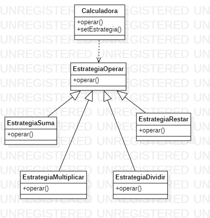

# Strategy

Strategy is a behavioral design pattern that allows you to define a family of algorithms, place each of them in a separate class and make their objects interchangeable.
It is classified as a behavioral pattern because it determines how the exchange of messages between different objects should be performed to solve a task. The strategy pattern allows maintaining a set of algorithms from which the client object can choose the one that suits it and exchange it dynamically according to its needs.

An example:
Calculator that performs simple mathematical operations, such as addition, subtraction, multiplication and division.


```java 
// Interfaz Estrategia
public interface Estrategia {
    int operar(int a, int b);```java 
}
// Clase Suma que implementa la interfaz Estrategia
public class Suma implements Estrategia {
    public int operar(int a, int b) {
        return a + b;
    }
}
// Clase Resta que implementa la interfaz Estrategia
public class Resta implements Estrategia {
    public int operar(int a, int b) {
        return a - b;
    }
}
// Clase Multiplicacion que implementa la interfaz Estrategia
public class Multiplicacion implements Estrategia {
    public int operar(int a, int b) {
        return a * b;
    }
}
// Clase Division que implementa la interfaz Estrategia
public class Division implements Estrategia {
    public int operar(int a, int b) {
        if (b == 0) {
            throw new IllegalArgumentException("No se puede dividir entre cero");
        }
        return a / b;
    }
}

// Clase Calculadora
public class Calculadora {
    private Estrategia estrategia;

    public Calculadora(Estrategia estrategia) {
        this.estrategia = estrategia;
    }

    public int ejecutarOperacion(int a, int b) {
        return estrategia.operar(a, b);
    }
    public void setEstrategia(Estrategia estrategia) {
        this.estrategia = estrategia;
    }
}
```
In this example, the interface Defines the Operate() method that will be in charge of performing the //mathematical operation, while the classes Addition, Subtraction, Multiplication and Division are the concrete classes that implement the Strategy interface and are in charge of implementing specific algorithms for each operation.
The Calculator class uses the currently selected strategy to perform a mathematical operation. The strategy is set in the constructor of the class and can be changed at run time using the setStrategy() method.


# Diagrama Strategy



