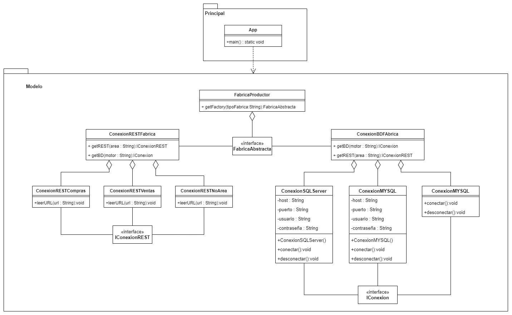

# Abstract Factory
Abstract Factory is a creational design pattern that provides an interface for creating families of related or dependent objects without specifying their concrete classes. In other words, the Abstract Factory pattern allows for the creation of a group of related objects without having to know their specific classes.

The Abstract Factory pattern works by defining an abstract factory class that specifies a set of methods for creating related objects. Subclasses of the abstract factory implement these methods to create different sets of related objects that conform to the same interface. This allows the client code to create different sets of related objects without having to know their specific classes.

## Class Diagram
<p align="center">
    
</p>

## Example:

```Java 
public interface IConexion{
    void conectar();
    void desconectar();
}
```

```Java 
public interface IConexionREST{
    void leerURL(String url);
}
```

```Java 
public interface FabricaAbstracta{
    IConexion getBD(String motor);
    IConexionREST getREST(String area);
}
```

```Java 
public class conexionRESTCompras implements IConexionREST{
    
    @Override
    public void leerURL(String url){
        System.out.println("Conectandose a "+url);
    }
}
```

```Java 
public class conexionRESTVentas implements IConexionREST{
    
    @Override
    public void leerURL(String url){
        //TODO
    }
}
```

```Java 
public class conexionRESTNoArea implements IConexionREST{
    
    @Override
    public void leerURL(String url){
        System.out.println("Area no especificada ");
    }
}
```

```Java 
public class ConexionMYSQL implements IConexion{
    
    private String host;
    private String puerto;
    private String ususario;
    private String contraseña;
    
    public ConexionMYSQL(){
        this.host = "localhost";
        this.puerto = "3306";
        this.ususario = "root";
        this.contraseña = "123";
    }
    
    //Sobreescritura de metodos
    @Override
    public void conectar(){
        System.out.println("Se conecto con MYSQL");
    }
    @Override
    public void desconectar(){
        System.out.println("Se desconecto con MYSQL");
    }
}
```

```Java 
public class ConexionSQLServer implements IConexion{
    
    private String host;
    private String puerto;
    private String ususario;
    private String contraseña;
    
    public ConexionSQLServer(){
        this.host = "localhost";
        this.puerto = "1433";
        this.ususario = "root";
        this.contraseña = "123";
    }
    
    //Sobreescritura de metodos
    @Override
    public void conectar(){
        System.out.println("Se conecto con SQLServer");
    }
    @Override
    public void desconectar(){
        System.out.println("Se desconecto de SQLServer");
    }
}
```

```Java 
public class ConexionVacia implements IConexion{
    //Sobreescritura de metodos
    @Override
    public void conectar(){
        System.out.println("No se especifico provedor");
    }
    @Override
    public void desconectar(){
        System.out.println("No se especifico provedor");
    }
}
```

```Java 
public class ConexionBDFabrica implements FabricaAbstracta{
    
    @Override
    public IConexion getBD(String motor){
        if(motor == null){
            return nre ConexionVacia();
        }
        if(motor.equalsIgnoreCase("MYSQL")){
            return new conexionMYSQL();
        }else if(motor.equalsIgnoreCase("SQL")){
            return new conexionSQLServer();
        }
        
        return new ConexionVacia();
    }
    
    @Override
    public IConexionREST getREST(String area){
        return null;
    }
}
```

```Java 
public class ConexionRESTFabrica implements FabricaAbstracta{
    
    //Interfaz para retornar una instancia segun lo que reciba
    //Permite conservar la independencia
    @Override
    public IConexionREST getREST(String area){
        if(area == null){
            return nre conexionRESTNoArea();
        }
        if(area.equalsIgnoreCase("COMPRAS")){
            return new ConexionRESTCompras();
        }else if(area.equalsIgnoreCase("VENTAS")){
            return new ConexionRESTVentas();
        }
        
        return new ConexionVacia();
    }
    
    @Override
    public IConexion getREST(String motor){
        return null;
    }
}
```

```Java 
public class FabricaProductor {

	public static FabricaAbstracta getFactory(String tipoFabrica) {

		if (tipoFabrica.equalsIgnoreCase("BD")) {
			return new ConexionBDFabrica();

		} else if (tipoFabrica.equalsIgnoreCase("REST")) {
			return new ConexionRESTFabrica();
		}

		return null;
	}

}
```

```Java 
public class App {
    public static void main(String[] args) {
        
        FabricaAbstracta fabricaBD = FabricaProductor.getFactory("BD");
        IConexion conexionBD1 = fabricaBD.getBD("MYSQL");
        
        conexionBD1.conectar();
        
        FabricaAbstracta fabricaREST = FabricaProductor.getFactory("REST");
        IConexion conexionREST1 = fabricaREST.getBD("COMPRAS");
        
        conexionREST1.leerURL("www.youtube.com");
    }
}
```


[Back to the list](./README.md)