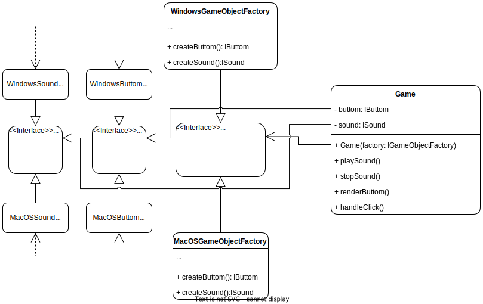

# Abstract Factory 
## Description
The Abstract Factory design pattern is a creational design pattern that provides an interface for creating families of related or dependent objects without specifying their concrete classes. It is an extension of the Factory Method pattern, which creates objects through inheritance, whereas the Abstract Factory pattern creates families of related objects through composition.
## Problem:
In some scenarios, a system may need to create families of related or dependent objects, but the exact classes of those objects may not be known in advance.

## Solution:
The Abstract Factory pattern provides a solution to the above problem by defining an abstract factory interface that encapsulates the creation of families of related or dependent objects. Concrete factory classes implement this interface to create concrete products that belong to the same family. The client code uses the abstract factory interface to create the desired objects, without knowing the exact classes that are being instantiated.
## Example: 
### Structure

    

### Implementation