# Builder
## Description
The Builder Design Pattern is a programming concept that enables us to create different objects with a base of code that we implement beforehand.

## Problem
When we need to create several similar objects with similar structures and behavior, we may be tempted to create different types of classes for each object. However, this approach can make our code hard to maintain and more complex.

## Solution

The solution to this problem is to abstract how each object is created by dividing it into its components, and then implementing these components as building blocks. We can then pass these components to a director class, which is responsible for creating different types of objects.

For example, let's say we want to produce various types of chairs, such as short, tall, cushioned, or designed for office or gaming use. Instead of creating a class for each type of chair, we can abstract the components of a chair, such as the four legs, the backrest, and the armrests. With these parts, we can assemble any type of chair we want by combining or adding new functionalities to each part.

Finally, to build the chair, we need a person who makes the decisions and puts the components together. This role is called The Director in the Builder Design Pattern.

## Example

Image that we are working for an computerAssambly Company, and this company has to bring the record the computed that they made.

### Structure 

The following diagram describes the pattern using the example as analogy

<p align="center">
    
</p>

### Implementation

First we need to create ourInterface, that allow us to create differents types of computers having the same base.

``` 
public interface computerBuilder {
    public void setProccesor(Proccesor procesor);
    public void setMotherBoard(String MotherBoard);
    public void setGraphicCard(GraphicCard graphicCard);
    public void setPowerSupply(String PowerSupply);
    public void setComputerType(computerType computertype);
    public void setCaseType(caseType casetype);
}
``` 

Next, we will need to create builders for the two types of computers that the company produces. These builders serve as recipe classes for each computer type.

```

public class LaptopBuilder implements computerBuilder{
    private Laptop officepc;
    private Proccesor procesador;
    private GraphicCard graphicCard;
    private String MotherBoard;
    private String PowerSupply;
    private computerType computertype;
    private caseType casetype;
    
    public void setCaseType(caseType casetype){
    this.casetype = casetype;
    }
    
    public void setComputerType(computerType computertype){
        this.computertype = computertype;
    }
    
    @Override
     public void setProccesor(Proccesor procesor){
         this.procesador = procesor;
     };
     
     @Override
     public void setMotherBoard(String MotherBoard){
         this.MotherBoard =  MotherBoard;
     };
     
    @Override
    public void setGraphicCard(GraphicCard graphicCard){
        this.graphicCard = graphicCard;
    };
    
    @Override
    public void setPowerSupply(String PowerSupply){
        this.PowerSupply = PowerSupply;
    }
    
    public Laptop getResult(){
        return new Laptop(procesador,graphicCard,MotherBoard,PowerSupply,computertype,casetype);
    }
    
}

public class PcBuilder implements computerBuilder{
    private PC gamerpc;
    private Proccesor procesador;
    private GraphicCard graphicCard;
    private String MotherBoard;
    private String PowerSupply;
    private computerType computertype;
    private caseType casetype;
    
    @Override
    public void setCaseType(caseType casetype){
        this.casetype = casetype;
    }
    
    @Override
    public void setComputerType(computerType computertype){
        this.computertype = computertype;
    }
    
    @Override
     public void setProccesor(Proccesor procesor){
         this.procesador = procesor;
     };
     
     @Override
     public void setMotherBoard(String MotherBoard){
         this.MotherBoard =  MotherBoard;
     };
     
    @Override
    public void setGraphicCard(GraphicCard graphicCard){
        this.graphicCard = graphicCard;
    };
    
    @Override
    public void setPowerSupply(String PowerSupply){
        this.PowerSupply = PowerSupply;
    }
    
    public PC getResult(){
        return new PC(procesador,graphicCard,MotherBoard,PowerSupply,computertype,casetype);
    }
}

```
then we crate the two object that are represented by the builder that we created.

```
public class PC {
    private Proccesor procesador;
    private GraphicCard graphicCard;
    private String MotherBoard;
    private String PowerSupply;
    private computerType computertype;
    private caseType casetype;

    public PC(Proccesor procesador, GraphicCard graphicCard, String MotherBoard, String PowerSupply,computerType computertype,caseType casetype) {
        this.procesador = procesador;
        this.graphicCard = graphicCard;
        this.MotherBoard = MotherBoard;
        this.PowerSupply = PowerSupply;
        this.computertype = computertype;
        this.casetype = casetype;
    }
    
    public String print(){
        String Info = "";
        Info += "type"+ computertype + "\n";
        Info += "Procesador: " + procesador.getName() + " " + procesador.getArquitecture() + "\n";
        Info += "Graphic Card: "+ graphicCard.getName()+ "Gb: "+ graphicCard.getGB() + "\n";
        Info += "MotherBoard: " + MotherBoard+ "\n";
        Info += "PoweSupply:" + PowerSupply;
        
        return Info;
    }
}

public class Laptop {
    private Proccesor procesador;
    private GraphicCard graphicCard;
    private String MotherBoard;
    private String PowerSupply;
    private computerType computertype;
    private caseType casetype;
    private int batteryLife = 100;

    public Laptop(Proccesor procesador, GraphicCard graphicCard, String MotherBoard, String PowerSupply,computerType computertype,caseType casetype) {
        this.procesador = procesador;
        this.graphicCard = graphicCard;
        this.MotherBoard = MotherBoard;
        this.PowerSupply = PowerSupply;
        this.computertype = computertype;
         this.casetype = casetype;
    }
    
    public String print(){
        String Info = "";
        Info += "type"+ computertype + "\n";
        Info += "Procesador: " + procesador.getName() + " " + procesador.getArquitecture() + "\n";
        Info += "Graphic Card: "+ graphicCard.getName()+ "Gb: "+ graphicCard.getGB() + "\n";
        Info += "MotherBoard: " + MotherBoard+ "\n";
        Info += "PoweSupply:" + PowerSupply + "BatteryLife:" + batteryLife + "\n";
        
        
        
        return Info;
    }
    
}

```

Finally, we create the Director class which is responsible for creating each type of computer that the company needs.

```
public class Director {
    
    public void contructorGamerPc(computerBuilder computerbuilder){
        computerbuilder.setProccesor(new Proccesor("Intel 7!","x86"));
        computerbuilder.setComputerType(computerType.GAMER_PC);
        computerbuilder.setGraphicCard(new GraphicCard("NvidiaRTX",10));
        computerbuilder.setMotherBoard("Gygabyte");
        computerbuilder.setCaseType(caseType.PC_Gamer_Case);
        computerbuilder.setPowerSupply("Gygabyte 2000 whats");
    }
    
    public void contructorLaptopOffice(computerBuilder computerbuilder){
        computerbuilder.setProccesor(new Proccesor("Intel Gen!","x86"));
        computerbuilder.setComputerType(computerType.OFFICE_LAPTOP);
        computerbuilder.setGraphicCard(new GraphicCard("None",0));
        computerbuilder.setMotherBoard("Gygabyte");
        computerbuilder.setCaseType(caseType.PC_Gamer_Case);
        computerbuilder.setPowerSupply("Gygabyte 2000 whats");
    }
    
    public void contructorGamerLaptop(computerBuilder computerbuilder){
        computerbuilder.setProccesor(new Proccesor("Intel 9!","x86"));
        computerbuilder.setComputerType(computerType.GAMER_LAPTOP);
        computerbuilder.setGraphicCard(new GraphicCard("NvidiaRTX 4060",10));
        computerbuilder.setMotherBoard("Gygabyte");
        computerbuilder.setCaseType(caseType.PC_Gamer_Case);
        computerbuilder.setPowerSupply("Gygabyte 2000 whats");
    }
    
}
```
As we can see, we are able to create and save various types of computers with multiple specifications using just two builder classes. By implementing the builder design pattern in this manner, we have achieved successful implementation of the pattern