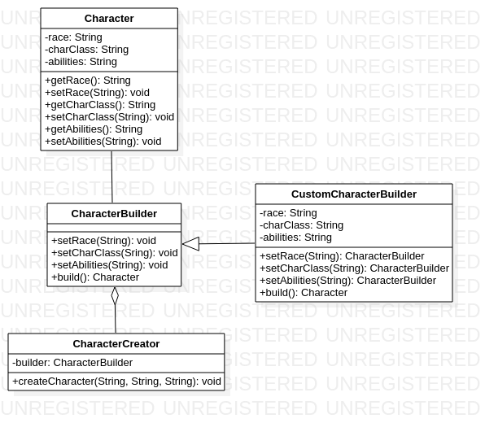

# Builder

The Builder pattern is a creational design pattern that separates the construction of a complex object from its representation, allowing the same construction process to create different representations. It is used to construct complex objects step by step and produce different types and representations of objects using the same construction code. The builder pattern is useful when the creation process is complex, and the result object is composed of many parts that need to be created in a specific order. By using this pattern, clients can create objects without knowing the underlying implementation details of the construction process. The builder pattern typically involves defining a builder interface, a concrete builder class that implements the interface, and a director class that uses the builder to construct the final object.

An example of the builder pattern using Java code could be:

Suppose you are developing a game where the player can create a custom character with different attributes, such as race, class, and abilities. However, the character creation process is complex, and there are many possible combinations of attributes. How can you simplify the creation of custom characters for the player? You can use the Builder pattern to separate the creation of the character object from its representation. Here's an example implementation in Java:

First, define the Character class with its attributes:

```java
public class Character {
    private String race;
    private String charClass;
    private String abilities;

    public Character(String race, String charClass, String abilities) {
        this.race = race;
        this.charClass = charClass;
        this.abilities = abilities;
    }

    // getters and setters omitted for brevity
}
```

Next, define the Builder interface with methods to set the character attributes:

```java
public interface CharacterBuilder {
    public CharacterBuilder setRace(String race);
    public CharacterBuilder setCharClass(String charClass);
    public CharacterBuilder setAbilities(String abilities);
    public Character build();
}
```

Then, implement the ConcreteBuilder class that implements the Builder interface and provides methods to set the character attributes:

```java
public class CustomCharacterBuilder implements CharacterBuilder {
    private String race;
    private String charClass;
    private String abilities;

    @Override
    public CharacterBuilder setRace(String race) {
        this.race = race;
        return this;
    }

    @Override
    public CharacterBuilder setCharClass(String charClass) {
        this.charClass = charClass;
        return this;
    }

    @Override
    public CharacterBuilder setAbilities(String abilities) {
        this.abilities = abilities;
        return this;
    }

    @Override
    public Character build() {
        return new Character(race, charClass, abilities);
    }
}
```

Finally, create a Director class that uses the Builder to construct the final Character object:

```java
public class CharacterCreator {
    private CharacterBuilder builder;

    public CharacterCreator(CharacterBuilder builder) {
        this.builder = builder;
    }

    public void createCharacter(String race, String charClass, String abilities) {
        builder.setRace(race)
            .setCharClass(charClass)
            .setAbilities(abilities);
    }
}
```

Now, you can use the CharacterCreator class to create custom characters with different combinations of attributes:

```java
CharacterBuilder builder = new CustomCharacterBuilder();
CharacterCreator creator = new CharacterCreator(builder);

creator.createCharacter("Elf", "Wizard", "Magic Missiles");
Character character = builder.build();
```

# Diagrama Builder




This way, the player can easily create custom characters by specifying the desired attributes, and the Builder pattern takes care of the complex creation process.