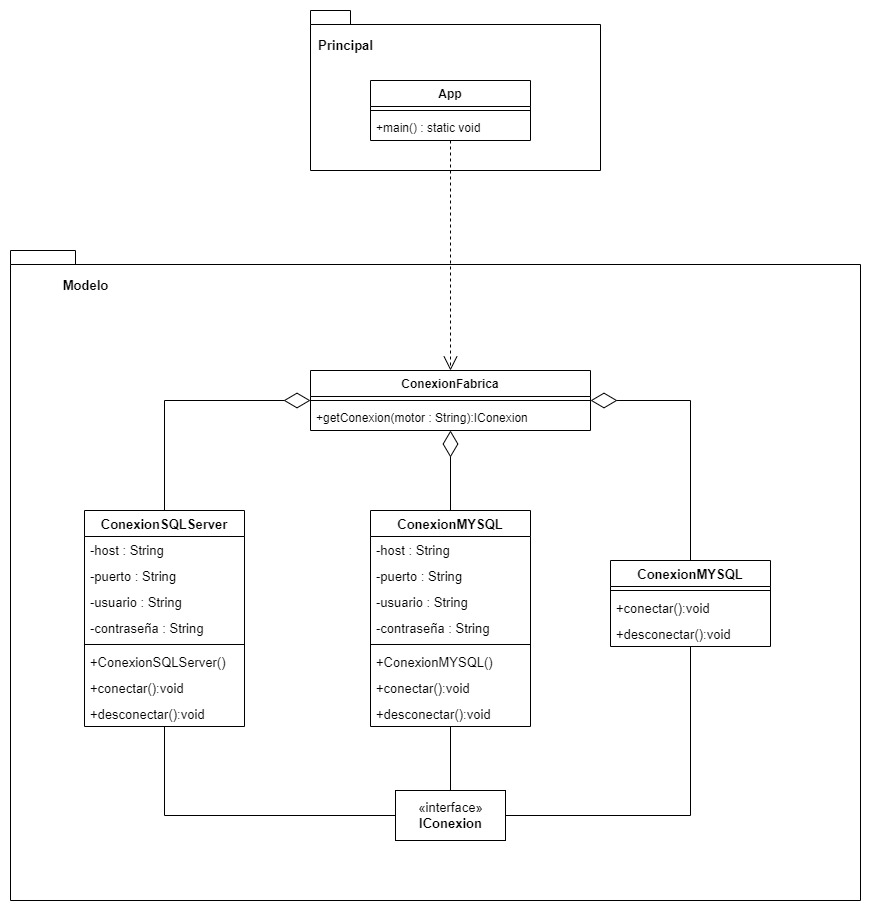

# Facctory Method
Factory Method is a creational design pattern that provides an interface for creating objects in a superclass, but allows subclasses to alter the type of objects that will be created. In other words, the Factory Method pattern separates the creation of objects from their use, allowing for more flexible and extensible code.

The Factory Method pattern works by defining a factory method in a superclass that creates objects of a particular class, but delegates the actual creation of the object to one or more subclasses. This allows subclasses to implement the factory method to create different types of objects based on their own needs.

By using the Factory Method pattern, code can be written to depend on abstractions rather than concrete classes, which makes the code more flexible and extensible. The Factory Method pattern is commonly used in situations where there are many different types of objects that need to be created, or where the type of object that needs to be created is not known until runtime.

## Example
```Java 
public interface IConexion{
    void conectar();
    void desconectar();
}
```

```Java 
public class ConexionMYSQL implements IConexion{
    
    private String host;
    private String puerto;
    private String ususario;
    private String contraseña;
    
    public ConexionMYSQL(){
        this.host = "localhost";
        this.puerto = "3306";
        this.ususario = "root";
        this.contraseña = "123";
    }
    
    @Override
    public void conectar(){
        System.out.println("Se conecto con MYSQL");
    }
    @Override
    public void desconectar(){
        System.out.println("Se desconecto con MYSQL");
    }
}
```

```Java 
public class ConexionSQLServer implements IConexion{
    
    private String host;
    private String puerto;
    private String ususario;
    private String contraseña;
    
    public ConexionSQLServer(){
        this.host = "localhost";
        this.puerto = "1433";
        this.ususario = "root";
        this.contraseña = "123";
    }
    
    @Override
    public void conectar(){
        System.out.println("Se conecto con SQLServer");
    }
    @Override
    public void desconectar(){
        System.out.println("Se desconecto de SQLServer");
    }
}
```

```Java 
public class ConexionVacia implements IConexion{
    @Override
    public void conectar(){
        System.out.println("No se especifico provedor");
    }
    @Override
    public void desconectar(){
        System.out.println("No se especifico provedor");
    }
}
```

```Java 
public class ConexionFabrica{
    
    //Interfaz para retornar una instancia segun lo que reciba
    public IConexion getConexion(String motor){
        if(motor == null){
            return nre ConexionVacia();
        }
        if(motor.equalsIgnoreCase("MYSQL")){
            return new conexionMYSQL();
        }else if(motor.equalsIgnoreCase("SQL")){
            return new conexionSQLServer();
        }
        
        return new ConexionVacia();
    }
}
```

```Java 
public class App {
    public static void main(String[] args) {
        conexionFabrica fabrica = new ConexionFabrica();
        
        IConexion cx1 = fabrica.getConexion("ORACLE");
        cx1.conectar();
        cx1.desconectar();
        
        IConexion cx1 = fabrica.getConexion("MYSQL");
        cx1.conectar();
        cx1.desconectar();
    }
}
```
<p align="center">
    
</p>

[Back to the list](./README.md)