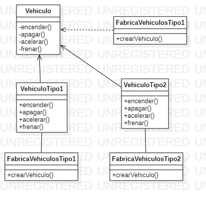

# Factory Method 

The Factory pattern, or Factory Method design pattern, describes a programming approach for creating objects without having to specify their exact class. This means that the created object can be interchanged with flexibility and ease. To implement this method, developers use the Factory Method, which gives this pattern its name. Its use can be specified in an interface or implemented by the child class or base class and optionally overridden (by derived classes). In doing so, the pattern or method takes the place of the normal class constructor to separate the creation of objects from the objects themselves. As a result, it is possible to follow SOLID principles.
In software design, the Factory Method design pattern consists of using an abstract (Abstract Factory-style) constructor class with a few defined methods and another abstract method(s): the one dedicated to the construction of objects of a subtype of a given type. It is a simplification of the Abstract Factory, in which the abstract class has concrete methods that use some of the abstract ones; depending on whether we use one or another child of this abstract class, we will have one or another behavior.

An example:
In this example, we have a Vehicle class that represents a generic vehicle and we want to manufacture different types of vehicles with different characteristics. For this, the factory design pattern is used, where the class VehicleFactory is responsible for creating the different types of vehicles.

```java
// Clase abstracta que define la interfaz de todos los vehículos
abstract class Vehiculo {
    public abstract void encender();
    public abstract void apagar();
    public abstract void acelerar();
    public abstract void frenar();
}

// Clase concreta de vehículo de tipo 1
class VehiculoTipo1 extends Vehiculo {
    @Override
    public void encender() {
        System.out.println("Encendiendo Vehiculo Tipo 1...");
    }

    @Override
    public void apagar() {
        System.out.println("Apagando Vehiculo Tipo 1...");
    }

    @Override
    public void acelerar() {
        System.out.println("Acelerando Vehiculo Tipo 1...");
    }

    @Override
    public void frenar() {
        System.out.println("Frenando Vehiculo Tipo 1...");
    }
}

// Clase concreta de vehículo de tipo 2
class VehiculoTipo2 extends Vehiculo {
    @Override
    public void encender() {
        System.out.println("Encendiendo Vehiculo Tipo 2...");
    }

    @Override
    public void apagar() {
        System.out.println("Apagando Vehiculo Tipo 2...");
    }

    @Override
    public void acelerar() {
        System.out.println("Acelerando Vehiculo Tipo 2...");
    }

    @Override
    public void frenar() {
        System.out.println("Frenando Vehiculo Tipo 2...");
    }
}

// Clase creadora que implementa el método fábrica
abstract class FabricaVehiculos {
    public abstract Vehiculo crearVehiculo();
}

// Subclase concreta de la clase creadora que crea vehículos de tipo 1
class FabricaVehiculoTipo1 extends FabricaVehiculos {
    @Override
    public Vehiculo crearVehiculo() {
        return new VehiculoTipo1();
    }
}


// Subclase concreta de la clase creadora que crea vehículos de tipo 2
class FabricaVehiculoTipo2 extends FabricaVehiculos {
    @Override
    public Vehiculo crearVehiculo() {
        return new VehiculoTipo2();
    }
}

// Clase de prueba que utiliza las fábricas de vehículos
public class Ejemplo {
    public static void main(String[] args) {
        FabricaVehiculos fabricaVehiculos = new FabricaVehiculoTipo1();
        Vehiculo vehiculo = fabricaVehiculos.crearVehiculo();
        vehiculo.encender();
        vehiculo.acelerar();
        vehiculo.frenar();
        vehiculo.apagar();

        fabricaVehiculos = new FabricaVehiculoTipo2();
        vehiculo = fabricaVehiculos.crearVehiculo();
        vehiculo.encender();
        vehiculo.acelerar();
        vehiculo.frenar();
        vehiculo.apagar();
    }
}

```


# Diagrama Factory Method Pattern

