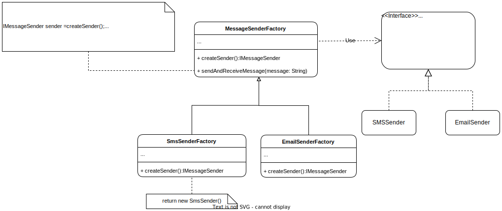

# Factory Method 

## Description:
The Factory Method design pattern is a way to create objects without knowing the exact class that needs to be instantiated. It suggests defining a separate method (the Factory Method) that encapsulates the object creation process. This method can be overridden by subclasses or implementation of interfaces to determine the type of object that should be created.


## Problem:
In object-oriented programming, there are scenarios where a class cannot anticipate the exact type of objects it needs to create. In such cases, a Factory Method design pattern is used to provide a framework for creating objects without specifying their exact class. This design pattern addresses the issue of tight coupling between a class and the objects it creates.

## Solution:
The Factory Method design pattern suggests defining an interface for creating objects, but allowing subclasses to decide which class to instantiate. The subclasses can choose the appropriate class based on the context in which they are being used. This design pattern encapsulates object creation in a separate method, isolating the client code from changes in the concrete class being used.

By using the Factory Method design pattern, we can achieve loose coupling between classes and simplify the addition of new types of products in the future.

## Example: 

Suppose you are developing a chat application that supports multiple messaging protocols, such as SMS, email, and social media platforms. Each protocol requires its own set of configuration options and API calls to send and receive messages, and you want to be able to easily add new messaging protocols to the application without modifying the existing code.

### Structure
The following diagram describes the pattern using the example as analogy

<p align="center">
    
</p>

### Implementation

To accomplish this, you can use the Factory Method pattern. First, define an interface called `MessageSender` that declares the methods that all messaging protocols should have:


``` Java
interface IMessageSender {
    void connect();
    void disconnect();
    void sendMessage(String message);
    String receiveMessage();
}
```

Next, create concrete classes that implement the `IMessageSender` interface for each messaging protocol. For example, here is a class for sending and receiving SMS messages, and another for Email Messages:

``` Java
class SmsSender implements IMessageSender {
    @Override
    public void connect() {
        // Connect to SMS service provider
    }
    
    @Override
    public void disconnect() {
        // Disconnect from SMS service provider
    }
    
    @Override
    public void sendMessage(String message) {
        // Send SMS message
    }
    
    @Override
    public String receiveMessage() {
        // Receive SMS message
        return "";
    }
}


class EmailSender implements IMessageSender {
    @Override
    public void connect() {
        // Connect to Email service provider
    }
    
    @Override
    public void disconnect() {
        // Disconnect from Email service provider
    }
    
    @Override
    public void sendMessage(String message) {
        // Send Email message
    }
    
    @Override
    public String receiveMessage() {
        // Receive Email message
        return "";
    }
}

```
Next, define an abstract factory class called `MessageSenderFactory` that contains the central logic for handling message sending and receiving requests. For example:


``` Java
abstract class MessageSenderFactory {
    public abstract IMessageSender createSender();
    
    public void sendAndReceiveMessage(String message) {
        IMessageSender sender = createSender();
        sender.connect();
        sender.sendMessage(message);
        String receivedMessage = sender.receiveMessage();
        sender.disconnect();
        System.out.println("Received message: " + receivedMessage);
    }
}


```
Here, the `MessageSenderFactory` class contains the central logic for handling message sending and receiving requests, and the `createSender()` method is abstract, which means that concrete factories for each messaging protocol must implement it.


Now, create concrete factory classes that extend the `MessageSenderFactory` class and implement the `createSender()` method for each messaging protocol. For example, here is a factory for sending and receiving SMS messages:

``` Java
class SmsSenderFactory extends MessageSenderFactory {
    @Override
    public IMessageSender createSender() {
        return new SmsSender();
    }
}

class EmailSenderFactory extends MessageSenderFactory {
    @Override
    public IMessageSender createSender() {
        return new EmailSender();
    }
}

```


Finally, in the client code, you can use the appropriate concrete factory to send and receive messages using each messaging protocol. For example:

``` Java
public class Main {
    public static void main(String[] args) {
        MessageSenderFactory smsFactory = new SmsSenderFactory();
        smsFactory.sendAndReceiveMessage("Hello, world!");
        
        MessageSenderFactory emailFactory = new EmailSenderFactory();
        emailFactory.sendAndReceiveMessage("Hello, world!");
    }
}

```