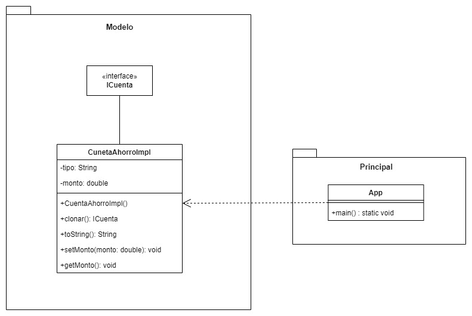

# Prototype
Prototype is a creational design pattern that allows objects to be created by cloning existing objects rather than creating new ones from scratch. In other words, the Prototype pattern provides a way to create new objects by copying or cloning existing objects.

The Prototype pattern works by defining a prototype object that serves as a template for creating new objects. This prototype object is then cloned to create new objects with the same properties and behavior as the original prototype. This allows new objects to be created without having to know the specific details of their construction.

## Class Diagram
<p align="center">
    
</p>

## Example:

```Java 
public interface ICuenta extends Cloneable{
    ICuenta clonar();
}
```

```Java 
public class CuentaAhorroImpl implements ICuenta{
    private String tipo;
    private double monto;
    
    public CuentaAhorroImpl(){
        tipo = "AHORRO";
    }
    
    @Override
    public ICuenta clonar(){
        CuentaAhorroImpl cuenta = null;
        
        try {
            cuenta = (CuentaAhorroImpl) clone();    
        } catch(CloneNotSupportedException e) {
            e.printStackTrace();                    
        }
    }
    
    @Override 
    public String toString(){
        return "CuentaAhorroImpl [tipo = " + tipo + ", monto = " + monto +"]";
    }
    
    public void setMonto(double monto){
        this.monto = monto;
    }
    public void getMonto(){
        return monto;
    }
}
```

```Java 
public class App{
    
    public static void main(String[] args){
        
        CuentaAhorroImpl cuentaAhorro = new CuentaAhorroImpl();
        cuentaAhorro.setMonto(200);
        
        CuentaAhorroImpl cuentaClone = (CuentaAhorroImpl) cuentaAhorro.clonar();
        
        if(cuentaClone != null){
            System.out.print(cuentaClone);
        }
        
        System.out.print(cuentaClone == cuentaAhorro); 
        
    }
}
```

[Back to the list](./README.md)