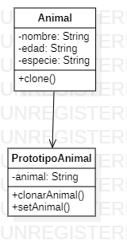

# Prototype

The Prototype pattern bases its functionality on the cloning of objects, these new objects are created by means of a pool of previously elaborated and stored prototypes. This pattern is especially useful when we need to create objects based on existing objects or when we need to create very large object structures, this pattern also helps us to hide the strategy used to clone an object.

An example:
Suppose we have a class called "Animal" that has several attributes and methods. We want to create an instance of this class and then create several copies of this instance. Instead of creating a new instance every time we need a copy, we use the prototype pattern.
First, we create the Animal class that implements the Clonable interface and has some attributes and methods.

```java
public class Animal implements Cloneable {
    private String nombre;
    private int edad;
    private String especie;
    
    public Animal(String nombre, int edad, String especie) {
        this.nombre = nombre;
        this.edad = edad;
        this.especie = especie;
    }
    
    public String getNombre() {
        return nombre;
    }
    
    public int getEdad() {
        return edad;
    }
    
    public String getEspecie() {
        return especie;
    }
    
    public void setNombre(String nombre) {
        this.nombre = nombre;
    }
    
    public void setEdad(int edad) {
        this.edad = edad;
    }
    
    public void setEspecie(String especie) {
        this.especie = especie;
    }
    
    @Override
    public Animal clone() throws CloneNotSupportedException {
        return (Animal) super.clone();
    }
}
//The Animal class implements the Clonable interface and overrides the clone() method that returns a copy of the real object. The clone() method returns an object of type Object, so we must convert it to the Animal type in order to use it.

//Now, we create a class called "PrototypeAnimal" that uses the Animal class to create multiple copies of an object.

public class PrototipoAnimal {
    private Animal animal;
    
    public PrototipoAnimal(Animal animal) {
        this.animal = animal;
    }
    
    public Animal clonarAnimal() throws CloneNotSupportedException {
        return animal.clone();
    }
    
    public void setAnimal(Animal animal) {
        this.animal = animal;
    }
}
```
The PrototypeAnimal class has an animal attribute of type Animal and a cloneAnimal() method that returns a copy of the animal object using the clone() method of the Animal class. In addition, the class has a setAnimal() method that does not allow changing the animal object used for cloning.


# Diagrama Prototype

