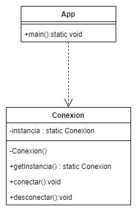

# Singleton pattern
The Singleton design pattern is a creational pattern that ensures that there is only one instance of a class throughout the system. This is achieved by creating a class that has a single private constructor and a static method that returns the sole instance of the class.

The Singleton pattern is used when a single instance of a class is needed throughout the system, such as to control access to a shared resource or to handle the configuration of an application. By having a single instance of the class, the creation of multiple unnecessary instances is avoided and the efficiency and performance of the system are improved.

### Example:

```Java 
public class Conexion{

	//Instance declaration
	private static Conexion instancia;

	//private constructor to not be allowed to use "new"
	private Conexion(){};

	//Create and/or get the instance via this method
	public static Conexion getInstancia(){
		if(instancia == null)
			instancia = new Conexion();
		return instancia;
	}

	//Testing method
	public void conectar(){
		system.out.println("Conectado a la base de datos");
	}
	public void desconectar(){
		system.out.println("Desconectado a la base de datos");
	}
}
```

```Java
public class App{

	public static void main(String[] args){
		Conexion c = Conexion.getInstancia();
		c.conectar();
		c.desconectar();
	}
}
```
<p align="center">
    
</p>

[Back to the list](./README.md)