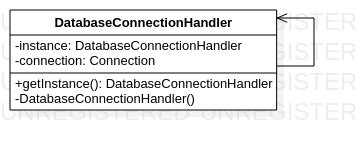

# Singleton

The Singleton pattern is a creational pattern that ensures a class has only one instance, while providing a global point of access to that instance. This means that no matter how many times the class is instantiated, there will only ever be one instance of it in the program. The Singleton pattern is often used when a single instance of a class is needed to coordinate actions across a system, such as managing a shared resource or a configuration file. It can also be useful for reducing memory usage and preventing conflicts that can arise when multiple instances of a class are created. To implement the Singleton pattern, the class typically has a private constructor to prevent direct instantiation, and a static method that provides access to the single instance.

An example of the builder Singleton using Java code could be:

You need to ensure that your program only has one instance of a particular class that is responsible for handling database connections. You can use the Singleton pattern to ensure that only one instance of the database connection handler class is created and used throughout the program. Here's an example implementation:

```java
public class DatabaseConnectionHandler {
    private static DatabaseConnectionHandler instance = null;
    private Connection connection;
    
    private DatabaseConnectionHandler() {
        // Private constructor to prevent direct instantiation
        // Initialize database connection here
        connection = DriverManager.getConnection("jdbc:mysql://localhost/mydatabase", "root", "password");
    }
    
    public static DatabaseConnectionHandler getInstance() {
        if (instance == null) {
            // Create new instance if one doesn't already exist
            instance = new DatabaseConnectionHandler();
        }
        return instance;
    }
    
    // Other methods for interacting with the database go here
}
```

# Diagrama Singleton



In this implementation, the DatabaseConnectionHandler class has a private constructor to prevent direct instantiation and a static method getInstance() that provides access to the single instance of the class. The first time getInstance() is called, it creates a new instance of the class and sets the instance variable to that instance. Subsequent calls to getInstance() simply return the existing instance. This ensures that only one instance of the DatabaseConnectionHandler class is created and used throughout the program.

