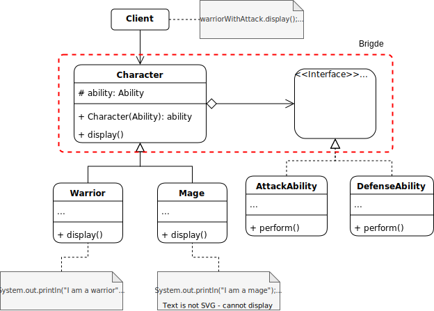

# Bridge

## Description

The Bridge pattern is a structural design pattern that allows you to separate the user interface of a class from its underlying implementation, allowing both to vary independently.

## Problem:

When you have multiple classes with different variants, such as different types of shapes, colors, fonts, etc., you can have a combinatorial explosion of classes that become difficult to maintain and extend. Instead, the Bridge pattern can be used to separate the variations of the main classes.

## Solution:

The solution offered by the Bridge pattern is to create two separate class hierarchies: one for the abstraction and one for the implementation. The abstraction defines the interface that the user interface uses to interact with the object, while the implementation defines the specifics of how that interface is implemented. This allows new variants of the implementation to be added without changing the user interface, and vice versa.

## Example:

Suppose we are developing a card game in which different characters have different abilities.

The problem is that adding new abilities for characters may require modifying all existing classes, which is tedious and error prone.

The solution is to apply the Bridge pattern to separate character classes from skill classes. In this way, you can create two separate class hierarchies, one for characters and one for abilities, and then connect them using an abstraction that allows you to assign abilities to characters.

### Structure:

<p align="center">
    
</p>

### Implementation:

```java
// Implementation of abilities
interface Ability {
    void perform();
}

class AttackAbility implements Ability {
    public void perform() {
        System.out.println("Performing attack");
    }
}

class DefenseAbility implements Ability {
    public void perform() {
        System.out.println("Performing defense");
    }
}
```

```java
// Implementation of characters
abstract class Character {
    protected Ability ability;

    public Character(Ability ability) {
        this.ability = ability;
    }

    abstract void display();
}

class Warrior extends Character {
    public Warrior(Ability ability) {
        super(ability);
    }

    void display() {
        System.out.println("I am a warrior");
        ability.perform();
    }
}

class Mage extends Character {
    public Mage(Ability ability) {
        super(ability);
    }

    void display() {
        System.out.println("I am a mage");
        ability.perform();
    }
}
```

```java
// Usage of the Bridge pattern
public class CardGame {
    public static void main(String[] args) {
        Ability attackAbility = new AttackAbility();
        Ability defenseAbility = new DefenseAbility();

        Warrior warriorWithAttack = new Warrior(attackAbility);
        warriorWithAttack.display(); // Prints "I am a warrior" and "Performing attack"

        Mage mageWithDefense = new Mage(defenseAbility);
        mageWithDefense.display(); // Prints "I am a mage" and "Performing defense"
    }
}
```

[Back to the list](./README.md)