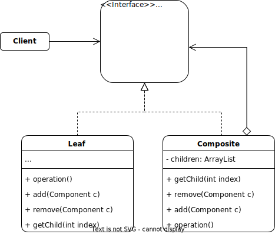

# Composite

## Description

The Composite pattern is a structural design pattern that allows you to build complex objects from simpler and similar objects, by creating a tree structure composed of composite and leaf objects. The goal is to treat individual objects and composites in the same way, allowing the client to work with them transparently.

In this pattern, a composite object contains a list of child objects (composites or leaves) and behaves like a leaf object for its parent container and like a container object for its children. This allows you to build a nested and recursive tree structure that can be treated as a single entity.

## Problem:

A common problem that can be solved with the Composite pattern is creating hierarchical structures of objects where individual and composite objects are treated in the same way. For example, a file in a directory structure is a composite object that contains files and other directories.

## Solution:

The solution to this problem is the implementation of the Composite pattern, which involves defining a common interface for all objects in the structure, both composites and leaves. This interface defines methods for adding, removing, and getting child objects, as well as performing operations on the objects in the structure.

## Example:

The Component interface defines the methods that must be implemented by all classes that are part of the composite structure. The Leaf class is a leaf class that implements the Component interface, while the Composite class is a composite class that contains a list of child objects and also implements the Component interface.

### Structure:

<p align="center">
    
</p>

### Implementation:

```java
interface Component {
    void operation();
    void add(Component c);
    void remove(Component c);
    Component getChild(int index);
}

class Leaf implements Component {
    public void operation() {
        // Implementation of the leaf operation
    }

    public void add(Component c) {
        // Throws an exception or does nothing since a leaf cannot have children
    }

    public void remove(Component c) {
        // Throws an exception or does nothing since a leaf cannot have children
    }

    public Component getChild(int index) {
        // Throws an exception or does nothing since a leaf cannot have children
        return null;
    }
}

class Composite implements Component {
    private List<Component> children = new ArrayList<>();

    public void operation() {
        // Implementation of the composite operation
        for (Component child : children) {
            child.operation();
        }
    }

    public void add(Component c) {
        children.add(c);
    }

    public void remove(Component c) {
        children.remove(c);
    }

    public Component getChild(int index) {
        return children.get(index);
    }
}
```

The Composite pattern allows you to create hierarchical structures of objects and treat them uniformly, regardless of whether they are individual or composite objects. This provides greater flexibility and extensibility to applications and can be easily implemented in any programming language.

[Back to the list](./README.md)