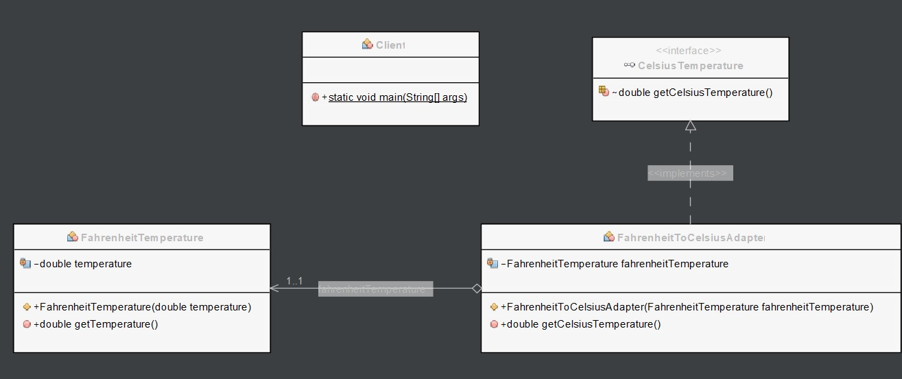

# Adapter pattern

The Adapter pattern is a software design pattern that allows the interface of an existing class to be used as another interface. In other words, it allows objects with incompatible interfaces to work together.

The Adapter pattern involves creating a new class that acts as a wrapper around an existing class, and exposes a different interface that is more appropriate for the client code. The adapter class translates requests from the client code into requests that the wrapped object can understand and vice versa.

The adapter pattern is often used when integrating two different systems or components, where one component has an interface that is incompatible with the other component. By using an adapter, the two components can work together seamlessly, without requiring any changes to either component's code.

# Class diagram



# Example
In the next example, we have an Adaptee class called FahrenheitTemperature which represents a temperature in Fahrenheit. 
It has a getTemperature method that returns the temperature in Fahrenheit.

```Java
// Adaptee
public class FahrenheitTemperature {
    private double temperature;

    public FahrenheitTemperature(double temperature) {
        this.temperature = temperature;
    }

    public double getTemperature() {
        return temperature;
    }
}
```

We want to use this class with a Target interface called CelsiusTemperature which represents a temperature in Celsius. 
It has a getCelsiusTemperature method that returns the temperature in Celsius.

```Java
// Target interface
public interface CelsiusTemperature {
    double getCelsiusTemperature();
}
```

We create an Adapter class called FahrenheitToCelsiusAdapter which implements the CelsiusTemperature interface and has a FahrenheitTemperature object as a field. 
In the getCelsiusTemperature method of FahrenheitToCelsiusAdapter, we get the temperature in Fahrenheit from the FahrenheitTemperature object, convert it to Celsius, and return the result.

```Java
// Adapter
public class FahrenheitToCelsiusAdapter implements CelsiusTemperature {
    private FahrenheitTemperature fahrenheitTemperature;

    public FahrenheitToCelsiusAdapter(FahrenheitTemperature fahrenheitTemperature) {
        this.fahrenheitTemperature = fahrenheitTemperature;
    }

    @Override
    public double getCelsiusTemperature() {
        double fahrenheitTemp = fahrenheitTemperature.getTemperature();
        return (fahrenheitTemp - 32) * 5 / 9;
    }
}
```

Finally, in the client code, we create an instance of FahrenheitTemperature and an instance of FahrenheitToCelsiusAdapter. We pass the FahrenheitTemperature object to the FahrenheitToCelsiusAdapter constructor to create an adapter object that implements the CelsiusTemperature interface. We then use this object to get the temperature in Celsius and print out both the Fahrenheit and Celsius temperatures. This allows us to use the FahrenheitTemperature class with the CelsiusTemperature interface without modifying either one.

```Java
// Client code
public class Client {
    public static void main(String[] args) {
        FahrenheitTemperature fahrenheitTemperature = new FahrenheitTemperature(68.0);
        CelsiusTemperature celsiusTemperature = new FahrenheitToCelsiusAdapter(fahrenheitTemperature);
        System.out.println("Fahrenheit temperature: " + fahrenheitTemperature.getTemperature());
        System.out.println("Celsius temperature: " + celsiusTemperature.getCelsiusTemperature());
    }
    
}
```

The result will be the following.

```Java
run:
Fahrenheit temperature: 68.0
Celsius temperature: 20.0
BUILD SUCCESSFUL (total time: 0 seconds)
```