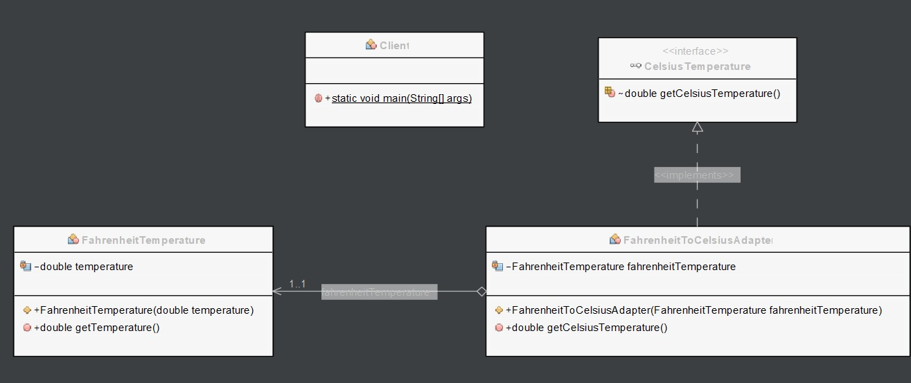
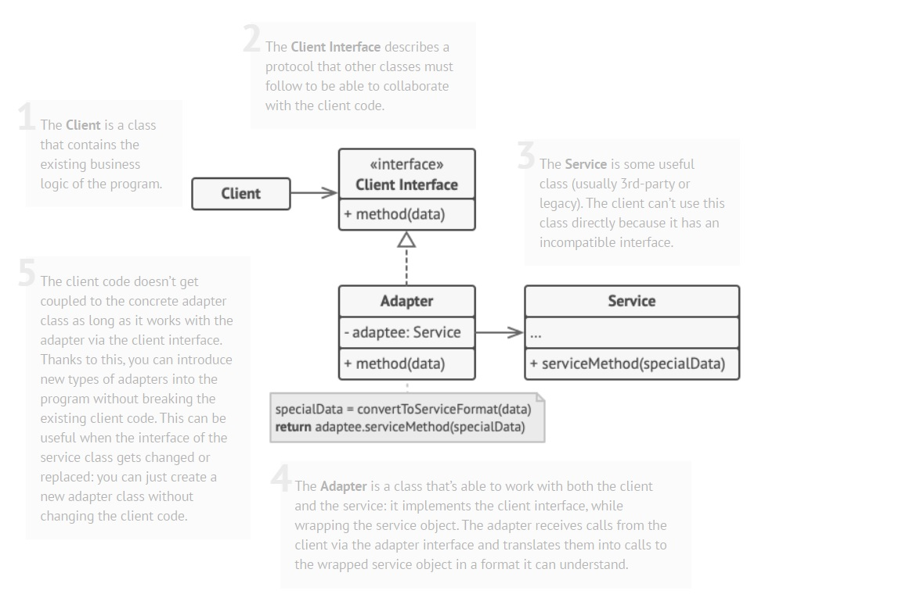

# Adapter pattern

## Description

<<<<<<< HEAD
The Adapter pattern is a design pattern in software engineering that allows objects with incompatible interfaces to collaborate by acting as a bridge between them. It converts the interface of a class into another interface that clients expect, thereby making two incompatible interfaces compatible. This pattern is useful in situations where existing code needs to be reused, but the interface of the code is not compatible with the new system or framework. The Adapter pattern helps to ensure that the code remains modular and reusable, which is important for software development.

## Problem:

Let's imagine that we have an application that processes information from different sensors. Each sensor has a different interface and communication protocol, making it difficult to handle all the data uniformly. To solve this problem, we could implement the Adapter pattern.

## Solution:

The solution would be to create an adapter for each type of sensor, which converts the information from that sensor to a common format and transmits it to the main application consistently. This way, we could handle all sensor data through a common interface, regardless of the type of sensor that generated it.

## Example:

A detailed example is presented showing how the "MySqlAdapter" adapter is implemented to allow the "MySql" class to be used through the "Database" interface.

### Structure:

<p align="center">
    
</p>

### Implementation:

Suppose you have a "Database" interface that defines a "query" method that accepts an SQL query:

```java
public interface Database {
    void query(String sqlQuery);
}
```

Now suppose you have a "MySql" class that handles connecting to a MySQL database and executing SQL queries:

```java
public class MySql {
    public void connect(String url, String user, String password) {
        // code to connect to a MySQL database
    }

    public void executeQuery(String sqlQuery) {
        // code to execute an SQL query on a MySQL database
=======
The Adapter pattern is a software design pattern that allows the interface of an existing class to be used as another interface. In other words, it allows objects with incompatible interfaces to work together.

The Adapter pattern involves creating a new class that acts as a wrapper around an existing class, and exposes a different interface that is more appropriate for the client code. The adapter class translates requests from the client code into requests that the wrapped object can understand and vice versa.

The adapter pattern is often used when integrating two different systems or components, where one component has an interface that is incompatible with the other component. By using an adapter, the two components can work together seamlessly, without requiring any changes to either component's code.

### Example
In the next example, we have an Adaptee class called ***FahrenheitTemperature*** which represents a temperature in Fahrenheit. 
It has a ***getTemperature*** method that returns the temperature in Fahrenheit.

```Java
// Adaptee
public class FahrenheitTemperature {
    private double temperature;

    public FahrenheitTemperature(double temperature) {
        this.temperature = temperature;
    }

    public double getTemperature() {
        return temperature;
>>>>>>> 1cd8696 (Update info)
    }
}
```

<<<<<<< HEAD
You want to use the "MySql" class instead of creating a new class to connect to a database and execute queries, but the "Database" interface only accepts SQL queries and not an instance of "MySql". To solve this problem, you can use the Adapter Pattern as follows:

```java
public class MySqlAdapter implements Database {

    private MySql mySql;

    public MySqlAdapter(MySql mySql) {
        this.mySql = mySql;
    }

    @Override
    public void query(String sqlQuery) {
        mySql.connect("localhost:3306/mydatabase", "user", "password");
        mySql.executeQuery(sqlQuery);
=======
We want to use this class with a Target interface called ***CelsiusTemperature*** which represents a temperature in Celsius. 
It has a ***getCelsiusTemperature*** method that returns the temperature in Celsius.

```Java
// Target interface
public interface CelsiusTemperature {
    double getCelsiusTemperature();
}
```

We create an Adapter class called ***FahrenheitToCelsiusAdapter*** which implements the ***CelsiusTemperature*** interface and has a ***FahrenheitTemperature*** object as a field. 
In the ***getCelsiusTemperature*** method of ***FahrenheitToCelsiusAdapter***, we get the temperature in Fahrenheit from the ***FahrenheitTemperature*** object, convert it to Celsius, and return the result.

```Java
// Adapter
public class FahrenheitToCelsiusAdapter implements CelsiusTemperature {
    private FahrenheitTemperature fahrenheitTemperature;

    public FahrenheitToCelsiusAdapter(FahrenheitTemperature fahrenheitTemperature) {
        this.fahrenheitTemperature = fahrenheitTemperature;
    }

    @Override
    public double getCelsiusTemperature() {
        double fahrenheitTemp = fahrenheitTemperature.getTemperature();
        return (fahrenheitTemp - 32) * 5 / 9;
>>>>>>> 1cd8696 (Update info)
    }
}
```

<<<<<<< HEAD
Now you can use the "MySqlAdapter" class to connect to a MySQL database and execute SQL queries through the "Database" interface:

```java
public class Main {

    public static void main(String[] args) {
        MySql mySql = new MySql();
        Database database = new MySqlAdapter(mySql);
        database.query("SELECT * FROM my_table");
    }
}
```

The "MySqlAdapter" class acts as an adapter between the "Database" interface and the "MySql" class. The "MySqlAdapter" class uses the instance of "MySql" to connect to a MySQL database and execute the SQL query passed as a parameter through the "query" method of the "Database" interface.

[Back to the list](./README.md)
=======
Finally, in the client code, we create an instance of ***FahrenheitTemperature*** and an instance of ***FahrenheitToCelsiusAdapter***. We pass the ***FahrenheitTemperature*** object to the ***FahrenheitToCelsiusAdapter*** constructor to create an adapter object that implements the ***CelsiusTemperature*** interface. We then use this object to get the temperature in Celsius and print out both the Fahrenheit and Celsius temperatures. This allows us to use the ***FahrenheitTemperature*** class with the ***CelsiusTemperature*** interface without modifying either one.

```Java
// Client code
public class Client {
    public static void main(String[] args) {
        FahrenheitTemperature fahrenheitTemperature = new FahrenheitTemperature(68.0);
        CelsiusTemperature celsiusTemperature = new FahrenheitToCelsiusAdapter(fahrenheitTemperature);
        System.out.println("Fahrenheit temperature: " + fahrenheitTemperature.getTemperature());
        System.out.println("Celsius temperature: " + celsiusTemperature.getCelsiusTemperature());
    }
    
}
```

The result will be the following.

```Java
run:
Fahrenheit temperature: 68.0
Celsius temperature: 20.0
BUILD SUCCESSFUL (total time: 0 seconds)
```

Next, we have the diagram class of Adapter example:



A description of the Adapter design pattern:


Image taken from https://refactoring.guru/es/design-patterns/adapter
>>>>>>> 1cd8696 (Update info)
