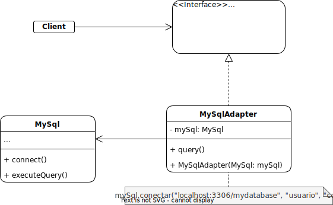

# Adapter pattern

## Description

The Adapter pattern is a design pattern in software engineering that allows objects with incompatible interfaces to collaborate by acting as a bridge between them. It converts the interface of a class into another interface that clients expect, thereby making two incompatible interfaces compatible. This pattern is useful in situations where existing code needs to be reused, but the interface of the code is not compatible with the new system or framework. The Adapter pattern helps to ensure that the code remains modular and reusable, which is important for software development.

## Problem:

Let's imagine that we have an application that processes information from different sensors. Each sensor has a different interface and communication protocol, making it difficult to handle all the data uniformly. To solve this problem, we could implement the Adapter pattern.

## Solution:

The solution would be to create an adapter for each type of sensor, which converts the information from that sensor to a common format and transmits it to the main application consistently. This way, we could handle all sensor data through a common interface, regardless of the type of sensor that generated it.

## Example:

A detailed example is presented showing how the "MySqlAdapter" adapter is implemented to allow the "MySql" class to be used through the "Database" interface.

### Structure:



### Implementation:

Suppose you have a "Database" interface that defines a "query" method that accepts an SQL query:

```java
public interface Database {
    void query(String sqlQuery);
}
```

Now suppose you have a "MySql" class that handles connecting to a MySQL database and executing SQL queries:

```java
public class MySql {
    public void connect(String url, String user, String password) {
        // code to connect to a MySQL database
    }

    public void executeQuery(String sqlQuery) {
        // code to execute an SQL query on a MySQL database
    }
}
```

You want to use the "MySql" class instead of creating a new class to connect to a database and execute queries, but the "Database" interface only accepts SQL queries and not an instance of "MySql". To solve this problem, you can use the Adapter Pattern as follows:

```java
public class MySqlAdapter implements Database {

    private MySql mySql;

    public MySqlAdapter(MySql mySql) {
        this.mySql = mySql;
    }

    @Override
    public void query(String sqlQuery) {
        mySql.connect("localhost:3306/mydatabase", "user", "password");
        mySql.executeQuery(sqlQuery);
    }
}
```

Now you can use the "MySqlAdapter" class to connect to a MySQL database and execute SQL queries through the "Database" interface:

```java
public class Main {

    public static void main(String[] args) {
        MySql mySql = new MySql();
        Database database = new MySqlAdapter(mySql);
        database.query("SELECT * FROM my_table");
    }
}
```

The "MySqlAdapter" class acts as an adapter between the "Database" interface and the "MySql" class. The "MySqlAdapter" class uses the instance of "MySql" to connect to a MySQL database and execute the SQL query passed as a parameter through the "query" method of the "Database" interface.

[Back to the list](./README.md)