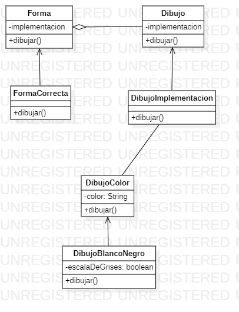

# Bridge

Bridge is a structural design pattern that allows you to split a large class, or a group of closely related classes, into two separate hierarchies (abstraction and implementation) that can be developed independently of each other.
According to the GoF book this design pattern allows you to decouple an abstraction from its implementation, so that the two can vary independently.
Suppose we have an abstract class in which we define a method to be implemented by each class that inherits from it: how would we do if a child class needs to implement it so that it performs different actions depending on certain circumstances?
In such cases we would find the Bridge pattern useful because it 'decouples an abstraction' (an abstract method) by allowing us to indicate (during program execution) to a class which 'implementation' of it to use (which actions to perform).

An example:

Suppose we are creating an application for drawing geometric shapes in a graphical user interface. We want the user to be able to choose between different types of drawing implementations, such as drawing in color, black and white, or grayscale. At the same time, we want the user to be able to draw different types of geometric shapes, such as squares, circles, triangles, etc.

To achieve this, we will apply the Bridge pattern. We create a DrawImplementation interface that defines the drawing implementation, and two concrete implementations: DrawAColor to draw in color, and DrawWhiteBlack to draw in black and white or grayscale. Then, we create an abstraction class Shapewhich defines the draw() method, and a concrete class ShapeConcretewhich implements the abstraction. Finally, in the main()method of our application, we create instances of shapes with different drawing implementations and draw them.

```java
// Interfaz que define la implementación de dibujo
interface DibujoImplementacion {
    void dibujar();
}

// Implementación concreta de dibujo a color
class DibujoAColor implements DibujoImplementacion {
    private String color;

    public DibujoAColor(String color) {
        this.color = color;
    }

    public void dibujar() {
        System.out.println("Dibujando en " + color);
    }
}

// Implementación concreta de dibujo en blanco y negro
class DibujoBlancoYNegro implements DibujoImplementacion {
    private boolean escalaDeGrises;

    public DibujoBlancoYNegro(boolean escalaDeGrises) {
        this.escalaDeGrises = escalaDeGrises;
    }

    public void dibujar() {
        if (escalaDeGrises) {
            System.out.println("Dibujando en escala de grises");
        } else {
            System.out.println("Dibujando en blanco y negro");
        }
    }
}

// Clase abstracción que define el método de dibujo
abstract class Forma {
    protected DibujoImplementacion implementacion;

    public Forma(DibujoImplementacion implementacion) {
        this.implementacion = implementacion;
    }

    public abstract void dibujar();
}

// Clase concreta que implementa la abstracción de forma
class FormaConcreta extends Forma {
    public FormaConcreta(DibujoImplementacion implementacion) {
        super(implementacion);
    }

    public void dibujar() {
        implementacion.dibujar();
    }
}

public class EjemploPuente {
    public static void main(String[] args) {
        // Crear formas con distintas implementaciones de dibujo
        Forma cuadradoRojo = new FormaConcreta(new DibujoAColor("rojo"));
        Forma circuloNegro = new FormaConcreta(new DibujoBlancoYNegro(false));
        Forma trianguloGris = new FormaConcreta(new DibujoBlancoYNegro(true));

        // Dibujar las formas
        cuadradoRojo.dibujar();
        circuloNegro.dibujar();
        trianguloGris.dibujar();
    }
}
```


# Diagrama Bridge

