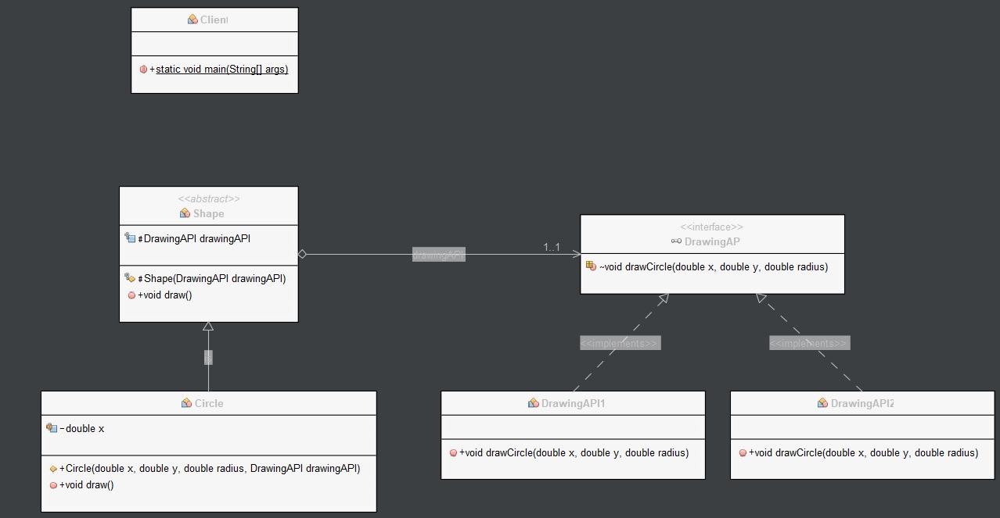

# Bridge pattern

Bridge is used when we need to decouple an abstraction from its implementation so that the two can vary independently. This type of design pattern comes under structural pattern as this pattern decouples implementation class and abstract class by providing a bridge structure between them.

This pattern involves an interface which acts as a bridge which makes the functionality of concrete classes independent from interface implementer classes. Both types of classes can be altered structurally without affecting each other.

# Class diagram



# Example

In this example, we have an Implementor interface called DrawingAPI which defines the interface for drawing circles.

```Java
// Implementor interface
public interface DrawingAPI {
    void drawCircle(double x, double y, double radius);
}
```

We have two Concrete Implementor classes, DrawingAPI1 and DrawingAPI2, which implement the DrawingAPI interface and provide different ways of drawing circles.

```Java
// Concrete Implementor 1
public class DrawingAPI1 implements DrawingAPI {
    @Override
    public void drawCircle(double x, double y, double radius) {
        System.out.printf("API1.circle at (%.2f, %.2f) radius %.2f\n", x, y, radius);
    }
}

// Concrete Implementor 2
public class DrawingAPI2 implements DrawingAPI {
    @Override
    public void drawCircle(double x, double y, double radius) {
        System.out.printf("API2.circle at (%.2f, %.2f) radius %.2f\n", x, y, radius);
    }
}
```

We have an Abstraction class called Shape which has a reference to the DrawingAPI interface. 
It also has an abstract draw method that will be implemented by its subclasses.

```Java
// Abstraction
public abstract class Shape {
    protected DrawingAPI drawingAPI;

    protected Shape(DrawingAPI drawingAPI) {
        this.drawingAPI = drawingAPI;
    }

    public abstract void draw();
}
```

We have a Refined Abstraction class called Circle which extends the Shape class and has fields for the x and y coordinates and the radius of the circle. It has a constructor that takes these parameters as well as a reference to the DrawingAPI interface. It overrides the draw method of the Shape class and calls the drawCircle method of the DrawingAPI interface.

```Java
// Refined Abstraction
public class Circle extends Shape {
    private double x, y, radius;

    public Circle(double x, double y, double radius, DrawingAPI drawingAPI) {
        super(drawingAPI);
        this.x = x;
        this.y = y;
        this.radius = radius;
    }

    @Override
    public void draw() {
        drawingAPI.drawCircle(x, y, radius);
    }
}
```

In the client code, we create an array of Shape objects and initialize them with instances of Circle. We pass in different implementations of the DrawingAPI interface to the Circle constructor to get different ways of drawing circles. We then call the draw method on each Shape object, which in turn calls the appropriate drawCircle method of the DrawingAPI object. This allows us to separate the abstraction and the implementation of drawing circles, and to easily swap in different implementations without changing the client code.

```Java
// Client code
public class Client {
    public static void main(String[] args) {
        Shape[] shapes = new Shape[2];
        shapes[0] = new Circle(1, 2, 3, new DrawingAPI1());
        shapes[1] = new Circle(5, 7, 11, new DrawingAPI2());

        for (Shape shape : shapes) {
            shape.draw();
        }
    }
    
}
```

The result will be the following.

```Java
run:
API1.circle at (1.00, 2.00) radius 3.00
API2.circle at (5.00, 7.00) radius 11.00
BUILD SUCCESSFUL (total time: 0 seconds)
```