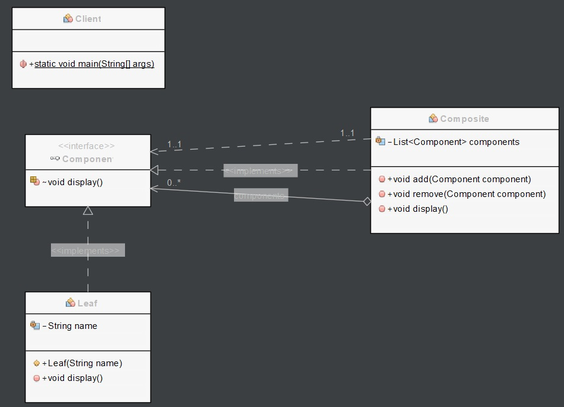

# Composite pattern

Composite pattern is used where we need to treat a group of objects in similar way as a single object. Composite pattern composes objects in term of a tree structure to represent part as well as whole hierarchy. This type of design pattern comes under structural pattern as this pattern creates a tree structure of group of objects.

This pattern creates a class that contains group of its own objects. This class provides ways to modify its group of same objects

# Class diagram



# Example

In this example, we have a Component interface which defines the interface for both Leaf and Composite objects.

```Java
// Component interface
public interface Component {
    void display();
}
```

We have a Leaf class which implements the Component interface and represents a single object in the composite structure.

```Java
// Leaf class
public class Leaf implements Component {
    private String name;

    public Leaf(String name) {
        this.name = name;
    }

    public void display() {
        System.out.println(name);
    }
}
```

We have a Composite class which also implements the Component interface and represents a collection of objects in the composite structure. It has a list of Component objects and provides methods to add and remove components. It also overrides the display method of the Component interface to display all the components in the list.

```Java
// Composite class
public class Composite implements Component {
    private List<Component> components = new ArrayList<>();

    public void add(Component component) {
        components.add(component);
    }

    public void remove(Component component) {
        components.remove(component);
    }

    public void display() {
        for (Component component : components) {
            component.display();
        }
    }
}
```

In the client code, we create several Leaf objects and two Composite objects. We add the Leaf objects to one Composite object, add the other Composite object to another Composite object, and then add that Composite object to the first Composite object. We then call the display method on the top-level Composite object, which displays all the objects in the composite structure. This allows us to treat both individual Leaf objects and collections of objects represented by Composite objects uniformly.

```Java
// Client code
public class Client {
    public static void main(String[] args) {
        Component leaf1 = new Leaf("Leaf 1");
        Component leaf2 = new Leaf("Leaf 2");
        Component leaf3 = new Leaf("Leaf 3");

        Composite composite1 = new Composite();
        composite1.add(leaf1);
        composite1.add(leaf2);

        Composite composite2 = new Composite();
        composite2.add(leaf3);

        Composite composite3 = new Composite();
        composite3.add(composite1);
        composite3.add(composite2);

        composite3.display();
    }
}
```

The result will be the following.

```Java
run:
Leaf 1
Leaf 2
Leaf 3
BUILD SUCCESSFUL (total time: 0 seconds)
```