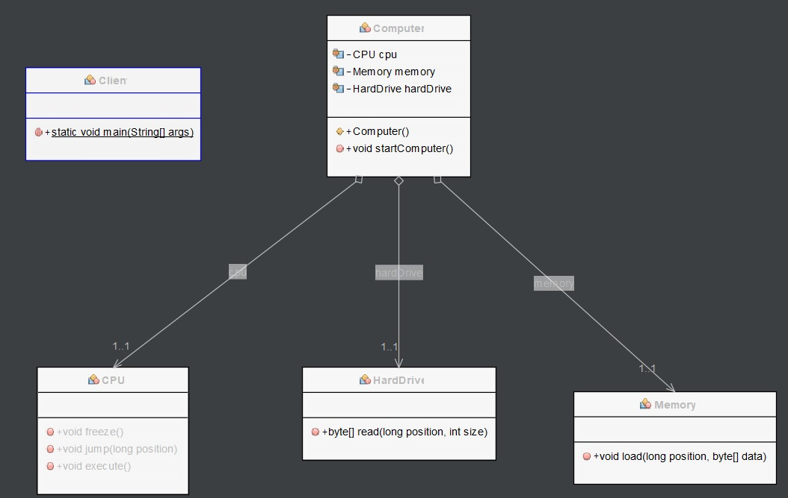
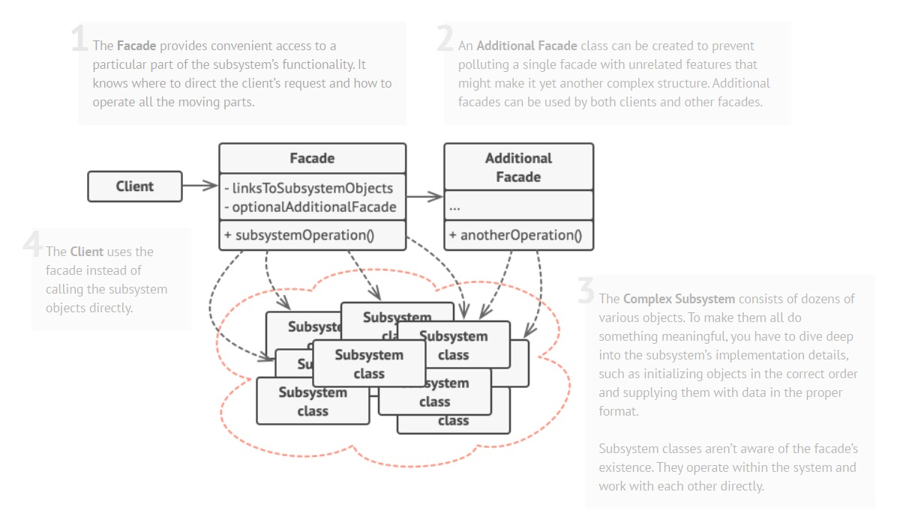

# Facade pattern

## Description

Facade pattern hides the complexities of the system and provides an interface to the client using which the client can access the system. This type of design pattern comes under structural pattern as this pattern adds an interface to existing system to hide its complexities.

This pattern involves a single class which provides simplified methods required by client and delegates calls to methods of existing system classes.

### Example

In this example, we have several subsystem classes that are responsible for different parts of the computer, including the CPU, Memory, and HardDrive classes.

```Java
// Subsystem classes
public class CPU {
    public void freeze() { 
        System.out.println("Freezing CPU..."); 
    }
    public void jump(long position) { 
        System.out.println("Jumping to position " + position + "..."); 
    }
    public void execute() { 
        System.out.println("Executing CPU instructions..."); 
    }
}

public class Memory {
    public void load(long position, byte[] data) {
        System.out.println("Loading data at position " + position + "...");
    }
}

public class HardDrive {
    public byte[] read(long position, int size) {
        System.out.println("Reading " + size + " bytes from hard drive at position " + position + "...");
        return new byte[size];
    }
}
```

We also have a Facade class called Computer that simplifies the interface to the subsystem classes. The Computer class has a reference to each of the subsystem classes, and it provides a method called startComputer that starts the computer by calling the appropriate methods on the subsystem classes in the correct order.

```Java
// Facade class
public class Computer {
    private CPU cpu;
    private Memory memory;
    private HardDrive hardDrive;

    public Computer() {
        cpu = new CPU();
        memory = new Memory();
        hardDrive = new HardDrive();
    }

    public void startComputer() {
        cpu.freeze();
        memory.load(0, hardDrive.read(0, 1024));
        cpu.jump(0);
        cpu.execute();
    }
}
```

In the client code, we create a Computer object and call its startComputer method, which starts the computer by calling the appropriate methods on the subsystem classes. The client code does not need to know about the details of the subsystem classes or the order in which they need to be called, because the Computer class handles that complexity for us.

```Java
// Client code
public class Client {
    public static void main(String[] args) {
        Computer computer = new Computer();
        computer.startComputer();
    }
}
```

By using the Facade pattern, we can simplify the interface to a complex system and make it easier to use. It also allows us to decouple the client code from the subsystem classes, which can make it easier to modify the system in the future.

The result will be the following.

```Java
run:
Freezing CPU...
Reading 1024 bytes from hard drive at position 0...
Loading data at position 0...
Jumping to position 0...
Executing CPU instructions...
BUILD SUCCESSFUL (total time: 0 seconds)
```

Next, we have the diagram class of Facade example:



A description of the Facade design pattern:


Image taken from https://refactoring.guru/design-patterns/facade