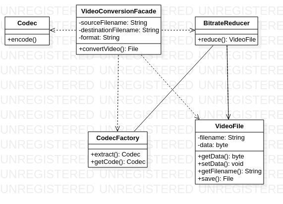

# Facade

The Facade design pattern is a structural design pattern that provides a simplified interface to a complex system of classes, libraries, or APIs. It encapsulates a set of interfaces, implementations, and/or subsystems behind a single high-level interface, making it easier to use and reducing the complexity of the system.

The Facade pattern is typically used when there is a need to hide or abstract the complexity of a system, and to provide a more user-friendly interface to clients. It also helps to reduce coupling between the client code and the underlying system components, which makes it easier to maintain and modify the system over time.

The Facade pattern can be implemented in a variety of ways, depending on the specific requirements of the system. Some common implementation strategies include creating a separate Facade class that wraps and delegates to the underlying subsystem components, or using a set of static methods that provide a simplified interface to the system.

Overall, the Facade pattern is a useful tool for simplifying the use of complex systems, improving their maintainability, and reducing the coupling between client code and system components.

An example of the facade pattern using Java code could be:

Suppose that you have a complex video conversion system with multiple subsystems, such as video codecs, audio codecs, and container formats. The client code needs to convert a video file from one format to another, but it has to deal with the complexity of the subsystems directly, which makes the code difficult to maintain and modify. You can use the Facade pattern to simplify the interface to the video conversion system and hide its complexity from the client code. Here's an example implementation:

```java 
// VideoConversionFacade.java - the facade class that simplifies the interface to the subsystems
public class VideoConversionFacade {
    public File convertVideo(String sourceFilename, String destinationFilename, String format) {
        VideoFile videoFile = new VideoFile(sourceFilename);
        Codec sourceCodec = CodecFactory.extract(videoFile);
        Codec destinationCodec = CodecFactory.getCodec(format);

        VideoFile intermediateResult = BitrateReducer.reduce(sourceCodec, videoFile);
        VideoFile finalResult = destinationCodec.encode(intermediateResult);

        return finalResult.save(destinationFilename);
    }
}

// CodecFactory.java - a factory class that creates and returns the appropriate codec for a given format
public class CodecFactory {
    public static Codec extract(VideoFile videoFile) {
        // implementation omitted for brevity
    }

    public static Codec getCodec(String format) {
        // implementation omitted for brevity
    }
}

// BitrateReducer.java - a subsystem that reduces the bitrate of a video file
public class BitrateReducer {
    public static VideoFile reduce(Codec codec, VideoFile videoFile) {
        // implementation omitted for brevity
    }
}

// VideoFile.java - a class that represents a video file
public class VideoFile {
    public VideoFile(String filename) {
        // implementation omitted for brevity
    }

    public byte[] getData() {
        // implementation omitted for brevity
    }

    public void setData(byte[] data) {
        // implementation omitted for brevity
    }

    public String getFilename() {
        // implementation omitted for brevity
    }

    public File save(String filename) {
        // implementation omitted for brevity
    }
}

// Codec.java - an interface that defines the methods of a video or audio codec
public interface Codec {
    // implementation omitted for brevity
}
```

# Diagrama Facade



In this example, the VideoConversionFacade class provides a simplified interface to the video conversion system, hiding the complexity of the subsystems behind it. The client code can simply call the convertVideo() method with the source filename, destination filename, and desired format, and the facade will take care of the rest. The subsystems, such as the CodecFactory and BitrateReducer, are still present and doing their work behind the scenes, but the client code doesn't need to worry about them.

Overall, this solution simplifies the use of the video conversion system, improves its maintainability, and reduces the coupling between the client code and the subsystem components, all thanks to the Facade pattern.
