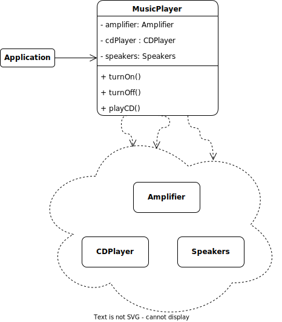

# Facade pattern

## Description

<<<<<<< HEAD
In software development, a facade is a design pattern that provides a simplified interface to a set of more complex subsystems. The facade acts as an abstraction layer that hides the complexity of the underlying system and provides an easy-to-use interface for the client. In other words, the facade is a class that wraps a set of more complex classes and provides a simple, easy-to-use interface for interacting with them.

## Problem:

Suppose you are developing a complex video editing software. This software has multiple components such as a video editor, audio editor, effects library, and color correction tools, among others. Each component has its own complex interface and interactions with other components.

## Solution:

In order for users to be able to purchase a product easily and efficiently, it would be ideal to have a simple and user-friendly interface that hides the complexity of all these behind-the-scenes processes.

This is where the Facade pattern comes in. You can create a class called "BuyFacade" that acts as an intermediate layer between the user interface and the complex processes behind the scenes. This class can provide simple, easy-to-use methods for user authentication, payment validation, and inventory management, thus hiding the complexity of the checkout process behind a simple, easy-to-use interface.

By using the Facade class, users can purchase products without having to worry about the complexity of behind-the-scenes processes. Instead of having to directly interact with each of these processes, they simply call the methods provided by the Facade class and let the class handle all the internal processes needed to complete the purchase.

## Example:

Suppose we have a music system with several complex classes and methods that interact with each other. Instead of exposing all these details to the user, we can create a facade that offers a simplified interface for the most common operations. Let's see how this could be implemented in Java:

### Structure:

<p align="center">
    
</p>

### Implementation:

```java
// We create a facade class that encapsulates the complexity of the music system
public class MusicFacade {
    private Amplifier amplifier;
    private CDPlayer cdPlayer;
    private Speakers speakers;

    public MusicFacade() {
        this.amplifier = new Amplifier();
        this.cdPlayer = new CDPlayer();
        this.speakers = new Speakers();
    }

    // We offer a simple method to turn on the music system
    public void turnOn() {
        System.out.println("Turning on the music system...");
        amplifier.turnOn();
        cdPlayer.turnOn();
        speakers.turnOn();
    }

    // We offer a simple method to turn off the music system
    public void turnOff() {
        System.out.println("Turning off the music system...");
        amplifier.turnOff();
        cdPlayer.turnOff();
        speakers.turnOff();
    }

    // We offer a simple method to play a CD
    public void playCD() {
        System.out.println("Playing CD...");
        cdPlayer.insertCD();
        amplifier.increaseVolume();
        speakers.turnOn();
    }
}

// We create some of the complex classes that are part of the music system
public class Amplifier {
    public void turnOn() {
        System.out.println("Turning on amplifier...");
    }

    public void turnOff() {
        System.out.println("Turning off amplifier...");
    }

    public void increaseVolume() {
        System.out.println("Increasing amplifier volume...");
    }
}

public class CDPlayer {
    public void turnOn() {
        System.out.println("Turning on CD player...");
    }

    public void turnOff() {
        System.out.println("Turning off CD player...");
    }

    public void insertCD() {
        System.out.println("Inserting CD into player...");
    }
}

public class Speakers {
    public void turnOn() {
        System.out.println("Turning on speakers...");
    }

    public void turnOff() {
        System.out.println("Turning off speakers...");
=======
Facade pattern hides the complexities of the system and provides an interface to the client using which the client can access the system. This type of design pattern comes under structural pattern as this pattern adds an interface to existing system to hide its complexities.

This pattern involves a single class which provides simplified methods required by client and delegates calls to methods of existing system classes.

### Example

In this example, we have several subsystem classes that are responsible for different parts of the computer, including the CPU, Memory, and HardDrive classes.

```Java
// Subsystem classes
public class CPU {
    public void freeze() { 
        System.out.println("Freezing CPU..."); 
    }
    public void jump(long position) { 
        System.out.println("Jumping to position " + position + "..."); 
    }
    public void execute() { 
        System.out.println("Executing CPU instructions..."); 
    }
}

public class Memory {
    public void load(long position, byte[] data) {
        System.out.println("Loading data at position " + position + "...");
    }
}

public class HardDrive {
    public byte[] read(long position, int size) {
        System.out.println("Reading " + size + " bytes from hard drive at position " + position + "...");
        return new byte[size];
>>>>>>> 1cd8696 (Update info)
    }
}
```

<<<<<<< HEAD
The MusicFacade class acts as a facade that hides the complexity of the music system and offers simple methods for the most common operations, such as turning on the system, turning it off, or playing a CD. When the user calls one of these methods, the facade interacts with the complex classes of the system to perform the requested task

[Back to the list](./README.md)
=======
We also have a Facade class called Computer that simplifies the interface to the subsystem classes. The Computer class has a reference to each of the subsystem classes, and it provides a method called startComputer that starts the computer by calling the appropriate methods on the subsystem classes in the correct order.

```Java
// Facade class
public class Computer {
    private CPU cpu;
    private Memory memory;
    private HardDrive hardDrive;

    public Computer() {
        cpu = new CPU();
        memory = new Memory();
        hardDrive = new HardDrive();
    }

    public void startComputer() {
        cpu.freeze();
        memory.load(0, hardDrive.read(0, 1024));
        cpu.jump(0);
        cpu.execute();
    }
}
```

In the client code, we create a Computer object and call its startComputer method, which starts the computer by calling the appropriate methods on the subsystem classes. The client code does not need to know about the details of the subsystem classes or the order in which they need to be called, because the Computer class handles that complexity for us.

```Java
// Client code
public class Client {
    public static void main(String[] args) {
        Computer computer = new Computer();
        computer.startComputer();
    }
}
```

By using the Facade pattern, we can simplify the interface to a complex system and make it easier to use. It also allows us to decouple the client code from the subsystem classes, which can make it easier to modify the system in the future.

The result will be the following.

```Java
run:
Freezing CPU...
Reading 1024 bytes from hard drive at position 0...
Loading data at position 0...
Jumping to position 0...
Executing CPU instructions...
BUILD SUCCESSFUL (total time: 0 seconds)
```

Next, we have the diagram class of Facade example:


A description of the Facade design pattern:


Image taken from https://refactoring.guru/design-patterns/facade
>>>>>>> 1cd8696 (Update info)
