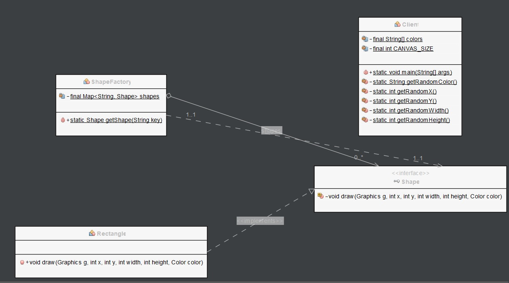

# Flyweight pattern

Flyweight pattern is primarily used to reduce the number of objects created and to decrease memory footprint and increase performance. This type of design pattern comes under structural pattern as this pattern provides ways to decrease object count thus improving the object structure of application.

Flyweight pattern tries to reuse already existing similar kind objects by storing them and creates new object when no matching object is found.

# Class diagram



# Example

In this example, we have a Flyweight interface which defines the interface for concrete flyweight objects.

```Java
import java.awt.Color;
import java.awt.Graphics;
import java.util.Random;
import javax.swing.JFrame;
import java.util.HashMap;
import java.util.Map;

// Flyweight interface
public interface Shape {
    void draw(Graphics g, int x, int y, int width, int height, Color color);
}
```

We have a concrete flyweight class called Rectangle which implements the Shape interface and represents a rectangle shape.

```Java
// Concrete Flyweight class
public class Rectangle implements Shape {
    public void draw(Graphics g, int x, int y, int width, int height, Color color) {
        g.setColor(color);
        g.fillRect(x, y, width, height);
    }
}
```

We also have a Flyweight factory class called ShapeFactory which maintains a pool of flyweight objects and provides a method called getShape to get a flyweight object for a given key. If a flyweight object with that key already exists in the pool, the factory returns that object. Otherwise, it creates a new flyweight object and adds it to the pool.

```Java
// Flyweight factory class
public class ShapeFactory {
    private static final Map<String, Shape> shapes = new HashMap<>();

    public static Shape getShape(String key) {
        Shape shape = shapes.get(key);

        if (shape == null) {
            shape = new Rectangle();
            shapes.put(key, shape);
        }

        return shape;
    }
}
```

In the client code, we create a JFrame and a Graphics object for the JFrame. We then create 1000 shapes using the ShapeFactory, randomly selecting colors, positions, and sizes for each shape. Because we are reusing flyweight objects from the ShapeFactory, the memory usage of our program is significantly reduced.

```Java
// Client code
public class Client {
    private static final String[] colors = {"Red", "Green", "Blue"};
    private static final int CANVAS_SIZE = 500;

    public static void main(String[] args) {
        Random random = new Random();
        JFrame frame = new JFrame("Flyweight Pattern Example");
        frame.setDefaultCloseOperation(JFrame.EXIT_ON_CLOSE);
        frame.setSize(CANVAS_SIZE, CANVAS_SIZE);
        frame.setVisible(true);

        Graphics g = frame.getGraphics();

        for (int i = 0; i < 1000; i++) {
            Shape shape = ShapeFactory.getShape(getRandomColor());
            shape.draw(g, getRandomX(), getRandomY(), getRandomWidth(), getRandomHeight(), Color.black);
        }
    }

    private static String getRandomColor() {
        return colors[(int)(Math.random() * colors.length)];
    }

    private static int getRandomX() {
        return (int)(Math.random() * CANVAS_SIZE);
    }

    private static int getRandomY() {
        return (int)(Math.random() * CANVAS_SIZE);
    }

    private static int getRandomWidth() {
        return (int)(Math.random() * 100);
    }

    private static int getRandomHeight() {
        return (int)(Math.random() * 100);
    }
}
```

By using the Flyweight pattern, we can optimize the performance of our program by reusing objects and reducing memory usage.

The result will be the following.

```Java
run:
BUILD SUCCESSFUL (total time: 4 seconds)
```