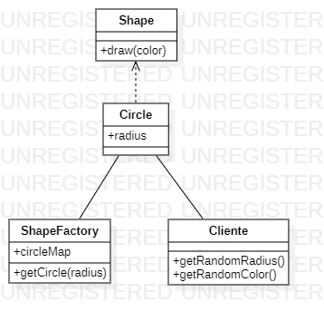

# Flyweight

Flyweight Pattern is a structural design pattern that is used to reduce the number of objects created and optimize the performance of an application by sharing similar objects.
Flyweight Pattern is a memory-efficient JAVA design pattern that is an integral part of structural design patterns. This pattern is used in code that requires the creation of a large number of objects. As the name suggests, objects created with this pattern (generally referred to as flyweight objects) occupy as little memory as possible, which frees up space for other goals and functions to be performed. The main goal of the flyweight pattern is to reduce the number of objects created and reduce memory consumption.

An example:

In this example, a Circle object factory (ShapeFactory) is created that is responsible for creating and storing Circle objects with different radii. When a Circle object with a given radius is requested, the factory checks if a Circle object with that radius already exists in its map of created objects (circleMap). If it already exists, it returns the existing object. If it does not exist, it creates a new one and adds it to the map.
The client uses the factory to obtain Circle objects with random radii and draws them on the screen with random colors.
In this way, it is possible to reduce the number of Circle objects created and stored in memory, reusing existing objects instead of creating new ones for each request. This can significantly improve performance and reduce memory usage in applications that require the creation of many similar objects.

```java
import java.awt.Color;
import java.util.HashMap;
import java.util.Map;

// Flyweight interface
interface Shape {
    void draw(Color color);
}

// Concrete Flyweight class
class Circle implements Shape {
    private int radius;

    public Circle(int radius) {
        this.radius = radius;
        System.out.println("Creating circle with radius " + radius);
    }

    public void draw(Color color) {
        System.out.println("Drawing circle with radius " + radius + " and color " + color);
    }
}

// Flyweight Factory class
class ShapeFactory {
    private Map<Integer, Shape> circleMap = new HashMap<>();

    public Shape getCircle(int radius) {
        Circle circle = (Circle) circleMap.get(radius);

        if (circle == null) {
            circle = new Circle(radius);
            circleMap.put(radius, circle);
        }

        return circle;
    }
}

// Client class
public class Client {
    private static final Color[] COLORS = { Color.RED, Color.GREEN, Color.BLUE, Color.WHITE, Color.BLACK };
    private static final int[] RADII = { 1, 2, 3, 4, 5 };

    public static void main(String[] args) {
        ShapeFactory shapeFactory = new ShapeFactory();

        for (int i = 0; i < 20; i++) {
            Shape circle = shapeFactory.getCircle(getRandomRadius());
            circle.draw(getRandomColor());
        }
    }

    private static int getRandomRadius() {
        return RADII[(int) (Math.random() * RADII.length)];
    }

    private static Color getRandomColor() {
        return COLORS[(int) (Math.random() * COLORS.length)];
    }
}
```
In this example, the Shape interface represents the Flyweight class and the Circle class represents the concrete class. The ShapeFactory class is in charge of creating and storing objects of the Circle class and returning them when required.

The client uses the factory to obtain Circle objects, to which it assigns a radius and a random color and draws them on the screen. As can be seen, Circle objects are created only once and then reused.


# Diagrama Flyweight

