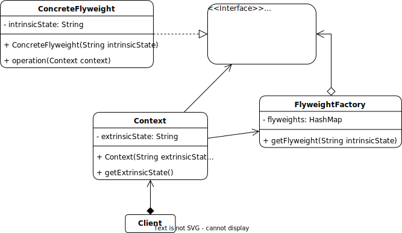

# Flyweight

## Description

The Flyweight pattern is a structural design pattern that allows you to share objects that have similar properties, reducing the memory usage and improving performance. It achieves this by storing the intrinsic (immutable) state of objects in a separate Flyweight object and the extrinsic (mutable) state in the context object. The Flyweight objects are shared between multiple contexts, while the context objects vary and are unique to each use.

The main idea behind the Flyweight pattern is to avoid creating too many objects that have the same properties, which can lead to a high memory footprint and slow down the application. By sharing objects, you can save memory and improve performance, especially in applications that handle a large number of similar objects.

## Problem:

A common problem that can be solved with the Flyweight pattern is the creation of large numbers of similar objects that consume a lot of memory. For example, a text editor application that needs to display a large number of characters on the screen. Each character could be represented by a separate object, which would lead to a high memory usage. Instead, by using the Flyweight pattern, each character can be represented by a shared Flyweight object, reducing memory usage.

## Solution:

The solution to this problem is to implement the Flyweight pattern, which involves separating the intrinsic state of the objects from the extrinsic state and creating a Flyweight factory that creates and manages the shared Flyweight objects. The Flyweight factory ensures that only one instance of each Flyweight object is created and shared between multiple contexts.

## Example:

The Flyweight interface defines the method for the operation, which uses the intrinsic state and the extrinsic state in the context. The ConcreteFlyweight class implements the Flyweight interface and stores the intrinsic state in a private field. The FlyweightFactory class creates and manages the shared Flyweight objects and ensures that only one instance of each Flyweight object is created. The Context class stores the extrinsic state.

### Structure:

<p align="center">
    
</p>

### Implementation:

```java
interface Flyweight {
    void operation(Context context);
}

class ConcreteFlyweight implements Flyweight {
    private final String intrinsicState;

    public ConcreteFlyweight(String intrinsicState) {
        this.intrinsicState = intrinsicState;
    }

    public void operation(Context context) {
        // Implementation of the operation using the intrinsic state and the extrinsic state in the context
    }
}

class FlyweightFactory {
    private final Map<String, Flyweight> flyweights = new HashMap<>();

    public Flyweight getFlyweight(String intrinsicState) {
        if (!flyweights.containsKey(intrinsicState)) {
            flyweights.put(intrinsicState, new ConcreteFlyweight(intrinsicState));
        }
        return flyweights.get(intrinsicState);
    }
}

class Context {
    private final String extrinsicState;

    public Context(String extrinsicState) {
        this.extrinsicState = extrinsicState;
    }

    public String getExtrinsicState() {
        return extrinsicState;
    }
}

// Client code
FlyweightFactory flyweightFactory = new FlyweightFactory();
Context context1 = new Context("Extrinsic state 1");
Context context2 = new Context("Extrinsic state 2");

Flyweight flyweight1 = flyweightFactory.getFlyweight("Intrinsic state");
flyweight1.operation(context1);

Flyweight flyweight2 = flyweightFactory.getFlyweight("Intrinsic state");
flyweight2.operation(context2);
```

The Flyweight pattern allows you to reduce memory usage and improve performance by sharing objects that have similar properties. By separating the intrinsic state from the extrinsic state, you can create shared objects that can be used in multiple contexts. The Flyweight pattern is especially useful in applications that handle a large number of similar objects

[Back to the list](./README.md)