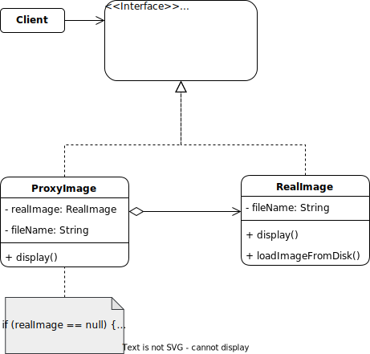

# Proxy pattern

## Description

The proxy pattern is a design pattern that provides a substitute or placeholder for another object to control its access, creation, or behavior. A proxy object allows the client to interact with the original object through an interface and provides an additional layer of abstraction for handling the requests and responses to the original object

## Problem:

We are developing an application to access a remote server that stores and processes large amounts of data. However, due to limitations in the network or server, direct connection to this server may be slow or unreliable. To solve this problem, we can use the Proxy pattern.

## Solution:

The solution would be to create a Proxy object that acts as an intermediary between the application and the remote server. The Proxy will handle communication with the server and optimize data transfer, so that the application can access the data more quickly and efficiently.

## Example:

The Proxy pattern is useful when we need to control access to a resource, such as a large image, that is expensive to create or load into memory. We'll use the ProxyImage class to control access to RealImage objects that represent images on disk.

### Structure:



### Implementation:

First, we will create an interface called Image that defines the operations that can be performed on an image:

```java
public interface Image {
    void display();
}
```
Next, we will create a concrete class RealImage that implements the Image interface:

```java
public class RealImage implements Image {
    private String fileName;

    public RealImage(String fileName) {
        this.fileName = fileName;
        loadImageFromDisk();
    }

    @Override
    public void display() {
        System.out.println("Displaying " + fileName);
    }

    private void loadImageFromDisk() {
        System.out.println("Loading " + fileName);
    }
}
```

Finally, we will create a ProxyImage class that also implements the Image interface. ProxyImage maintains a reference to an instance of RealImage and only creates and loads it into memory when necessary:

```java
public class ProxyImage implements Image {
    private RealImage realImage;
    private String fileName;

    public ProxyImage(String fileName) {
        this.fileName = fileName;
    }

    @Override
    public void display() {
        if (realImage == null) {
            realImage = new RealImage(fileName);
        }
        realImage.display();
    }
}
```

This way, we can use ProxyImage to access an image without having to load it into memory until it is actually needed. Here's an example of how it could be used:

```java
public class Main {
    public static void main(String[] args) {
        Image image1 = new ProxyImage("photo1.jpg");
        Image image2 = new ProxyImage("photo2.jpg");

        // Image 1 is loaded into memory and displayed
        image1.display();

        // Image 2 is not yet loaded into memory
        image2.display();

        // Image 2 is loaded into memory and displayed
        image2.display();
    }
}
```

The image1 is loaded into memory and displayed when display() is called for the first time. image2, on the other hand, is only loaded into memory when display() is called for the first time and then displayed in both calls to display().

[Back to the list](./README.md)