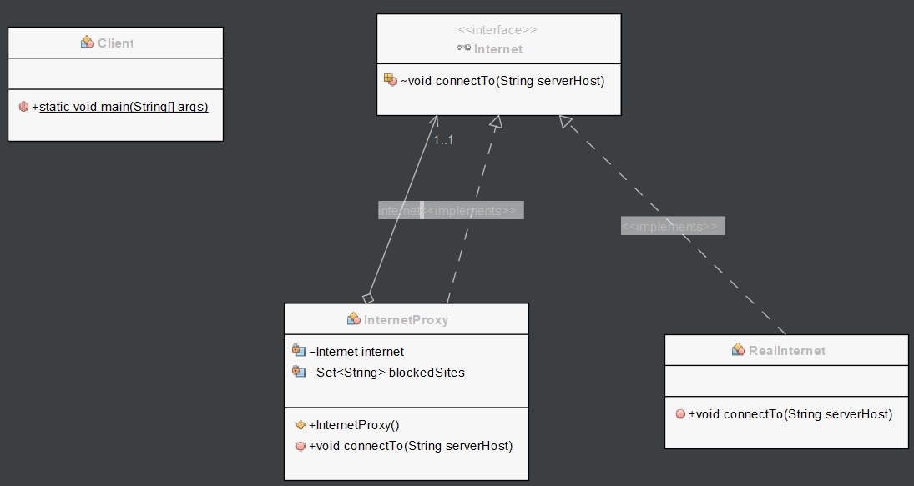
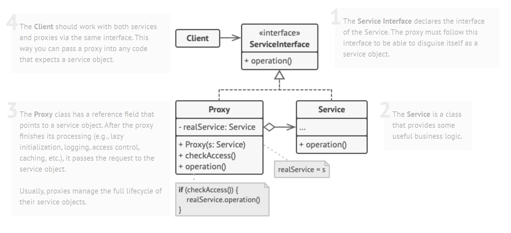

# Proxy pattern

## Description

In proxy pattern, a class represents functionality of another class. This type of design pattern comes under structural pattern.

In proxy pattern, we create object having original object to interface its functionality to outer world.

### Example

In this example, we have a Subject interface called Internet which defines the interface for the Real subject class and the Proxy class.

```Java
// Subject interface
public interface Internet {
    void connectTo(String serverHost) throws Exception;
}
```

We have a Real subject class called RealInternet which implements the Internet interface and represents the actual object that the client wants to use.

```Java
// Real subject class
public class RealInternet implements Internet {
    public void connectTo(String serverHost) throws Exception {
        System.out.println("Connecting to " + serverHost);
    }
}
```

We also have a Proxy class called InternetProxy which also implements the Internet interface and acts as a proxy for the RealInternet object. The InternetProxy class maintains a set of blocked websites and prevents the client from accessing those websites by throwing an exception.

```Java
// Proxy class
public class InternetProxy implements Internet {
    private Internet internet;
    private Set<String> blockedSites;

    public InternetProxy() {
        internet = new RealInternet();
        blockedSites = new HashSet<>();
        blockedSites.add("facebook.com");
        blockedSites.add("twitter.com");
    }

    public void connectTo(String serverHost) throws Exception {
        if (blockedSites.contains(serverHost)) {
            throw new Exception("Access Denied to " + serverHost);
        }

        internet.connectTo(serverHost);
    }
}
```

In the client code, we create an instance of the InternetProxy class and use it to connect to Google, Facebook, and Twitter. We can see that access to Facebook and Twitter is denied because they are blocked by the InternetProxy.

```Java
// Client code
public class Client {
    public static void main(String[] args) throws Exception {
        Internet internet = new InternetProxy();

        internet.connectTo("google.com");
        internet.connectTo("facebook.com"); // Access denied
        internet.connectTo("twitter.com"); // Access denied
    }
    
}
```

By using the Proxy pattern, we can add an additional layer of security or functionality to our program without modifying the original code. This can be useful when we want to control access to an object or add logging, caching, or other features.

The result will be the following.

```Java
//To google
run:
Connecting to google.com
BUILD SUCCESSFUL (total time: 0 seconds)
```

```Java
//To Facebook
run:
Exception in thread "main" java.lang.Exception: Access Denied to facebook.com
	at proxy.InternetProxy.connectTo(InternetProxy.java:19)
	at proxy.Client.main(Client.java:9)
BUILD FAILED (total time: 0 seconds)
```

```Java
//To Twitter
run:
Exception in thread "main" java.lang.Exception: Access Denied to twitter.com
	at proxy.InternetProxy.connectTo(InternetProxy.java:19)
	at proxy.Client.main(Client.java:10)
BUILD FAILED (total time: 0 seconds)
```

Next, we have the diagram class of Proxy example:



A description of the Proxy pattern:


Image taken from https://refactoring.guru/design-patterns/proxy