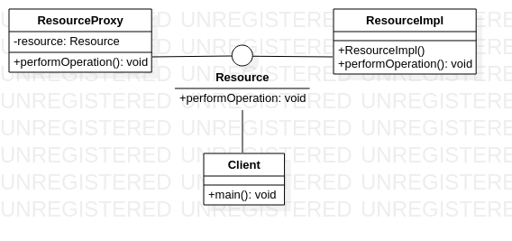

# Proxy

The Proxy pattern provides a surrogate or placeholder for another object to control access to it. In other words, it allows you to create a proxy object that acts as an intermediary between a client object and the real object it needs to interact with. This can be useful for a variety of reasons, such as:

1. Delaying the creation of an expensive object until it is actually needed
2. Restricting access to an object to only certain clients
3. Adding additional functionality or behavior to an object without modifying its code directly

To implement the Proxy pattern, you typically create a proxy object that has the same interface as the real object it represents. When a client requests a certain operation on the proxy object, the proxy may perform additional processing before passing the request on to the real object, or it may simply forward the request directly to the real object.

Overall, the Proxy pattern provides a way to control access to an object while maintaining a consistent interface for clients to interact with.

An example of the proxy pattern using Java code could be:

Imagine that you have a resource-intensive object that takes a long time to create and consumes a lot of memory. You want to delay its creation until it is actually needed, and you want to restrict access to it so that only certain clients can use it. You can use the Proxy pattern to create a proxy object that acts as an intermediary between the client objects and the real object. The proxy object has the same interface as the real object, so clients can interact with it in the same way. However, the proxy object delays the creation of the real object until it is actually needed. Here's some example code in Java to implement this solution:

```java 
public interface Resource {
    void performOperation();
}

public class ResourceImpl implements Resource {
    public ResourceImpl() {
        // Expensive object creation
        try {
            Thread.sleep(5000); // simulate long initialization time
        } catch (InterruptedException ex) {
            ex.printStackTrace();
        }
    }

    public void performOperation() {
        System.out.println("Operation performed on real object");
    }
}

public class ResourceProxy implements Resource {
    private Resource resource;

    public void performOperation() {
        if (resource == null) {
            resource = new ResourceImpl();
        }
        resource.performOperation();
    }
}

public class Client {
    public static void main(String[] args) {
        Resource proxy = new ResourceProxy();
        // Do some work with the proxy object
        proxy.performOperation();
    }
}
```

# Diagrama Proxy



In this example, you have an interface Resource that defines the operations that can be performed on the resource object. You also have a concrete implementation ResourceImpl that performs the actual operations, but takes a long time to initialize.

To delay the creation of the ResourceImpl object until it is actually needed, you create a ResourceProxy object that acts as a surrogate for the ResourceImpl object. When a client requests an operation on the proxy object, the proxy object checks if the real object has been created yet. If not, it creates it on the fly. Once the real object is created, the proxy simply forwards the operation to it.

Finally, you have a Client class that uses the proxy object to perform some work. The client doesn't know or care whether it's interacting with the real object or the proxy object, since they have the same interface.
