

  # Screenshots

  ## Productos

--------------

  ## findAll
  ------------------
  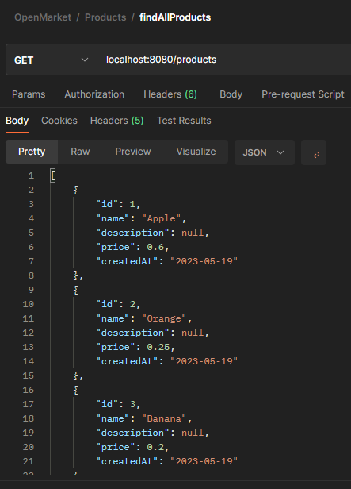

  ------------------
  ## findById
  ------------------

  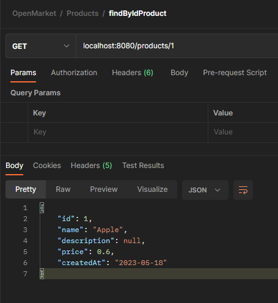

  ------------------
  ## create
  ------------------

  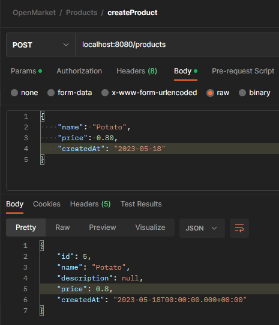

  ------------------
  ## update
  ------------------

  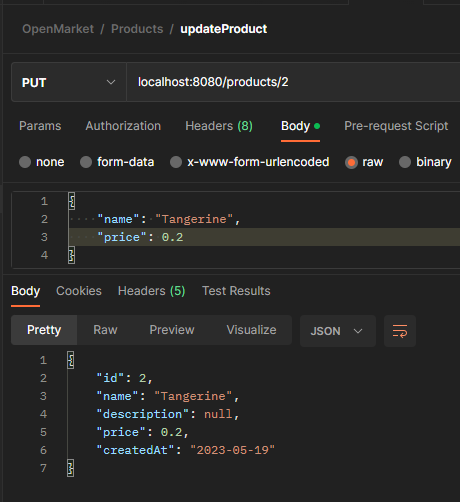

  ------------------
  ## delete
  ------------------

  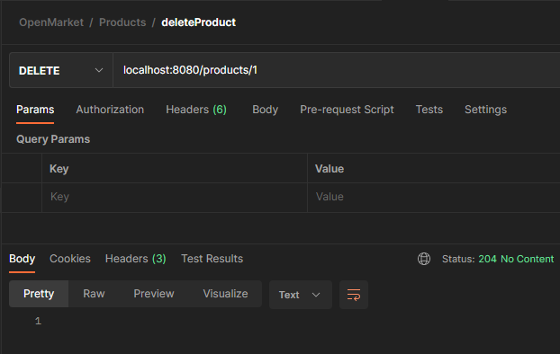

  ------------------
  ## data after deletion
  ------------------

  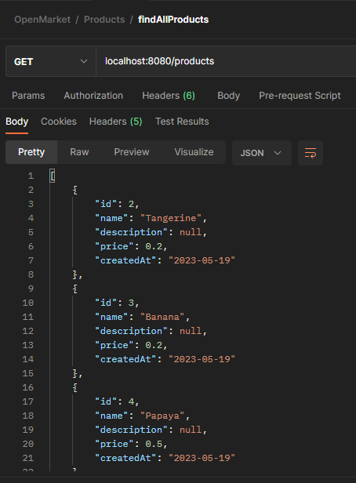

-------------------

  # Categorias

-------------------

  ## findAll
  ------------------

  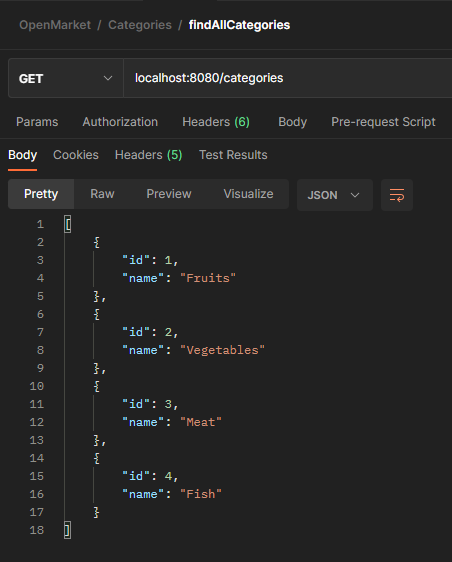

  ------------------
  ## findById
  ------------------

  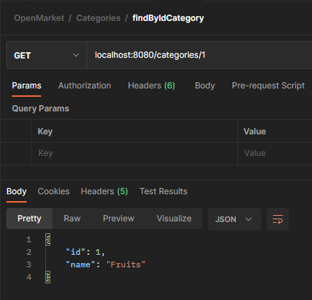

  ------------------
  ## create
  ------------------

  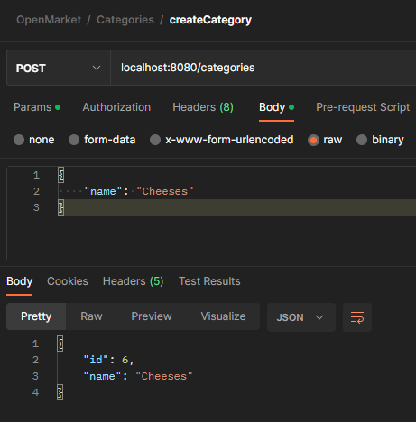

  ------------------
  ## update
  ------------------

  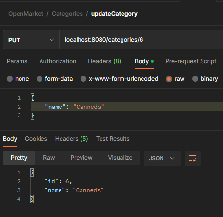

  ------------------
  ## delete
  ------------------

  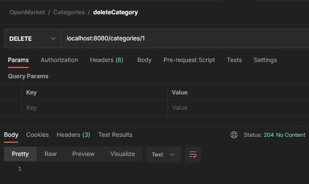

  ------------------
  ## data after deletion
  ------------------

  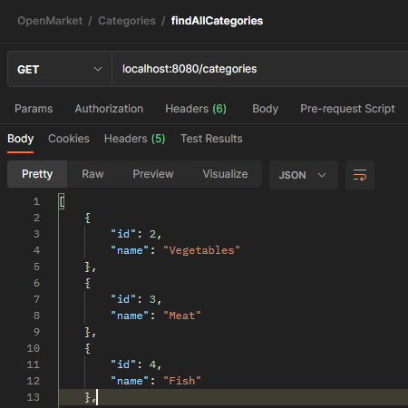

